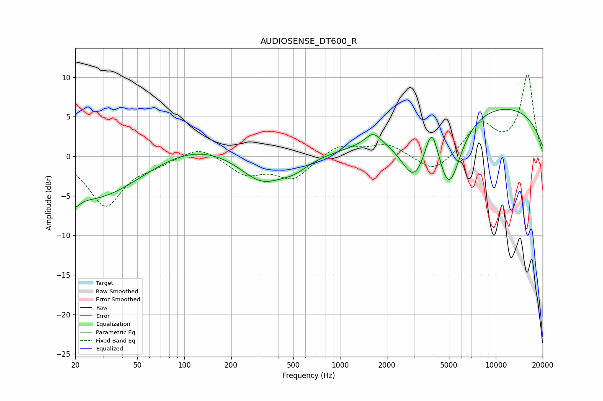

# AUDIOSENSE_DT600_R
See [usage instructions](https://github.com/jaakkopasanen/AutoEq#usage) for more options and info.

### Parametric EQs
Apply preamp of -6.0 dB when using parametric equalizer.

|   # | Type    |   Fc (Hz) |    Q |   Gain (dB) |
|-----|---------|-----------|------|-------------|
|   1 | Peaking |        20 | 5.01 |        -1.2 |
|   2 | Peaking |        25 | 0.44 |        -5.7 |
|   3 | Peaking |       111 | 0.5  |         2.1 |
|   4 | Peaking |       316 | 0.99 |        -3.6 |
|   5 | Peaking |       510 | 1.64 |        -1.1 |
|   6 | Peaking |      1633 | 2.88 |         1.6 |
|   7 | Peaking |      2998 | 1.56 |        -6.3 |
|   8 | Peaking |      3880 | 3.26 |         4.9 |
|   9 | Peaking |      5006 | 1.74 |        -8.9 |
|  10 | Peaking |      8342 | 0.21 |         6.8 |

### Fixed Band EQs
When using fixed band (also called graphic) equalizer, apply preamp of **-10.4 dB** (if available) and set gains manually with these parameters.

|   # | Type    |   Fc (Hz) |    Q |   Gain (dB) |
|-----|---------|-----------|------|-------------|
|   1 | Peaking |        31 | 1.41 |        -6.2 |
|   2 | Peaking |        62 | 1.41 |        -0.8 |
|   3 | Peaking |       125 | 1.41 |         1.4 |
|   4 | Peaking |       250 | 1.41 |        -2.2 |
|   5 | Peaking |       500 | 1.41 |        -2.8 |
|   6 | Peaking |      1000 | 1.41 |         1.5 |
|   7 | Peaking |      2000 | 1.41 |         1.5 |
|   8 | Peaking |      4000 | 1.41 |        -2.3 |
|   9 | Peaking |      8000 | 1.41 |         4   |
|  10 | Peaking |     16000 | 1.41 |        10.2 |

### Graphs

