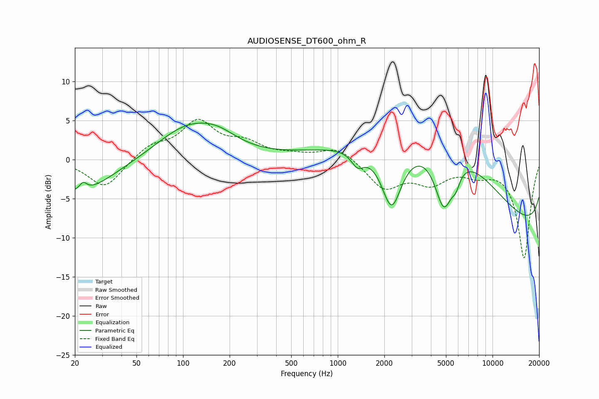

# AUDIOSENSE_DT600_ohm_R
See [usage instructions](https://github.com/jaakkopasanen/AutoEq#usage) for more options and info.

### Parametric EQs
Apply preamp of -4.7 dB when using parametric equalizer.

|   # | Type    |   Fc (Hz) |    Q |   Gain (dB) |
|-----|---------|-----------|------|-------------|
|   1 | Peaking |        20 | 0.64 |        -4.4 |
|   2 | Peaking |        23 | 5.96 |         1   |
|   3 | Peaking |       105 | 0.72 |         3.9 |
|   4 | Peaking |       167 | 1.08 |         1.7 |
|   5 | Peaking |      1343 | 3.41 |        -1.8 |
|   6 | Peaking |      2228 | 2.11 |        -8   |
|   7 | Peaking |      4851 | 2.26 |        -7.9 |
|   8 | Peaking |      5618 | 0.28 |        16.5 |
|   9 | Peaking |      5803 | 5.44 |        -1.5 |
|  10 | Peaking |     10000 | 0.18 |       -16.1 |

### Fixed Band EQs
When using fixed band (also called graphic) equalizer, apply preamp of **-5.2 dB** (if available) and set gains manually with these parameters.

|   # | Type    |   Fc (Hz) |    Q |   Gain (dB) |
|-----|---------|-----------|------|-------------|
|   1 | Peaking |        31 | 1.41 |        -3.7 |
|   2 | Peaking |        62 | 1.41 |         1.7 |
|   3 | Peaking |       125 | 1.41 |         4.6 |
|   4 | Peaking |       250 | 1.41 |         1.8 |
|   5 | Peaking |       500 | 1.41 |         0.4 |
|   6 | Peaking |      1000 | 1.41 |         1.7 |
|   7 | Peaking |      2000 | 1.41 |        -3.6 |
|   8 | Peaking |      4000 | 1.41 |        -2.6 |
|   9 | Peaking |      8000 | 1.41 |        -1.4 |
|  10 | Peaking |     16000 | 1.41 |       -12.6 |

### Graphs

