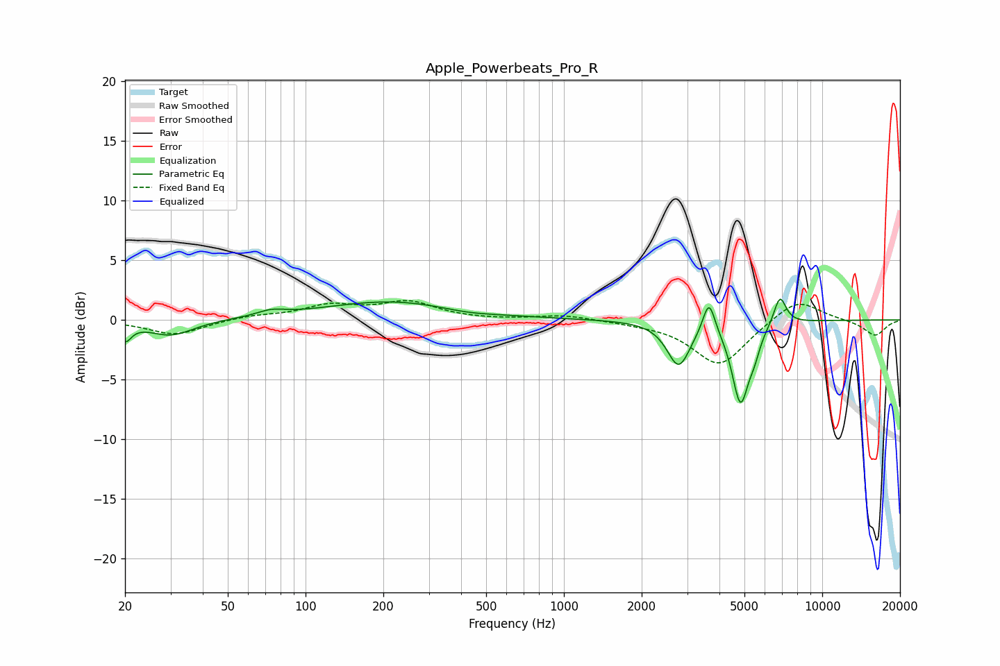

# Apple_Powerbeats_Pro_R
See [usage instructions](https://github.com/jaakkopasanen/AutoEq#usage) for more options and info.

### Parametric EQs
Apply preamp of -1.8 dB when using parametric equalizer.

|   # | Type    |   Fc (Hz) |    Q |   Gain (dB) |
|-----|---------|-----------|------|-------------|
|   1 | Peaking |        20 | 5.92 |        -1.4 |
|   2 | Peaking |        30 | 1.62 |        -1.3 |
|   3 | Peaking |        74 | 2.57 |         0.5 |
|   4 | Peaking |       217 | 0.53 |         1.6 |
|   5 | Peaking |       424 | 1.28 |        -0.3 |
|   6 | Peaking |      2781 | 3.19 |        -3.7 |
|   7 | Peaking |      3644 | 6    |         2.8 |
|   8 | Peaking |      4824 | 4.27 |        -6.7 |
|   9 | Peaking |      5458 | 6    |        -1.3 |
|  10 | Peaking |      6859 | 5.7  |         2.4 |

### Fixed Band EQs
When using fixed band (also called graphic) equalizer, apply preamp of **-1.7 dB** (if available) and set gains manually with these parameters.

|   # | Type    |   Fc (Hz) |    Q |   Gain (dB) |
|-----|---------|-----------|------|-------------|
|   1 | Peaking |        31 | 1.41 |        -1.3 |
|   2 | Peaking |        62 | 1.41 |         0.3 |
|   3 | Peaking |       125 | 1.41 |         1.1 |
|   4 | Peaking |       250 | 1.41 |         1.4 |
|   5 | Peaking |       500 | 1.41 |        -0   |
|   6 | Peaking |      1000 | 1.41 |         0.4 |
|   7 | Peaking |      2000 | 1.41 |        -0.2 |
|   8 | Peaking |      4000 | 1.41 |        -3.8 |
|   9 | Peaking |      8000 | 1.41 |         1.9 |
|  10 | Peaking |     16000 | 1.41 |        -1.3 |

### Graphs

