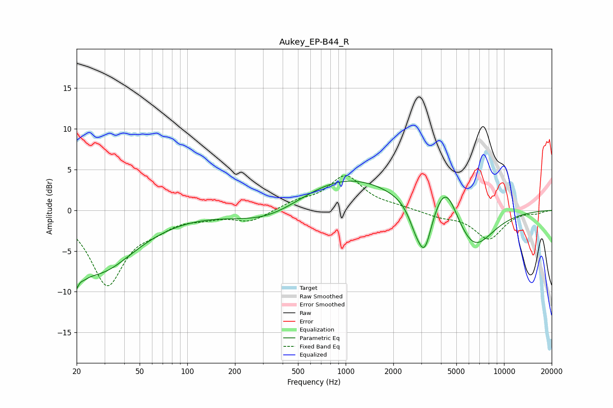

# Aukey_EP-B44_R
See [usage instructions](https://github.com/jaakkopasanen/AutoEq#usage) for more options and info.

### Parametric EQs
Apply preamp of -3.7 dB when using parametric equalizer.

|   # | Type    |   Fc (Hz) |    Q |   Gain (dB) |
|-----|---------|-----------|------|-------------|
|   1 | Peaking |        20 | 4.1  |        -6.9 |
|   2 | Peaking |        20 | 5.66 |         3.4 |
|   3 | Peaking |        27 | 0.67 |        -6.4 |
|   4 | Peaking |        37 | 0.51 |        -0.9 |
|   5 | Peaking |       328 | 0.65 |        -2   |
|   6 | Peaking |      1011 | 0.45 |         4.2 |
|   7 | Peaking |      2749 | 3.2  |        -1.8 |
|   8 | Peaking |      3149 | 3.07 |        -5.6 |
|   9 | Peaking |      4293 | 1.91 |         4.6 |
|  10 | Peaking |      6376 | 1.1  |        -5.2 |

### Fixed Band EQs
When using fixed band (also called graphic) equalizer, apply preamp of **-4.3 dB** (if available) and set gains manually with these parameters.

|   # | Type    |   Fc (Hz) |    Q |   Gain (dB) |
|-----|---------|-----------|------|-------------|
|   1 | Peaking |        31 | 1.41 |        -9   |
|   2 | Peaking |        62 | 1.41 |        -1.5 |
|   3 | Peaking |       125 | 1.41 |        -0.6 |
|   4 | Peaking |       250 | 1.41 |        -1.3 |
|   5 | Peaking |       500 | 1.41 |         0.9 |
|   6 | Peaking |      1000 | 1.41 |         4.1 |
|   7 | Peaking |      2000 | 1.41 |         0.3 |
|   8 | Peaking |      4000 | 1.41 |        -0.7 |
|   9 | Peaking |      8000 | 1.41 |        -3.5 |
|  10 | Peaking |     16000 | 1.41 |        -0.3 |

### Graphs

