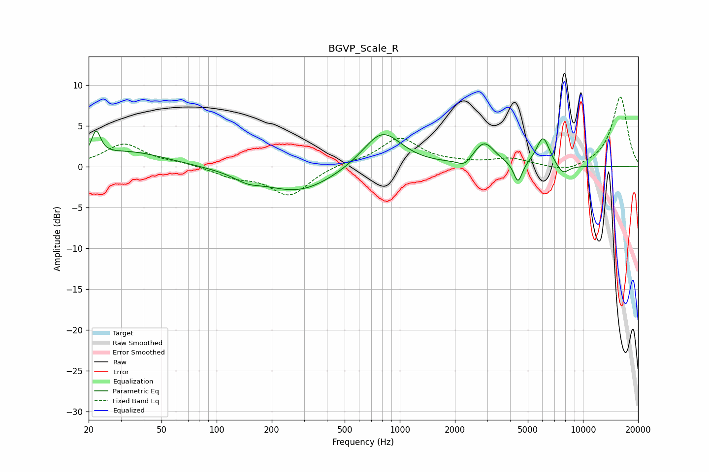

# BGVP_Scale_R
See [usage instructions](https://github.com/jaakkopasanen/AutoEq#usage) for more options and info.

### Parametric EQs
Apply preamp of -4.5 dB when using parametric equalizer.

|   # | Type    |   Fc (Hz) |    Q |   Gain (dB) |
|-----|---------|-----------|------|-------------|
|   1 | Peaking |        22 | 5.86 |         3.1 |
|   2 | Peaking |        33 | 0.69 |         1.8 |
|   3 | Peaking |       147 | 1.97 |        -0.8 |
|   4 | Peaking |       280 | 0.71 |        -3.1 |
|   5 | Peaking |       800 | 1.32 |         4.6 |
|   6 | Peaking |      2259 | 3.9  |        -0.9 |
|   7 | Peaking |      2885 | 2.47 |         2.8 |
|   8 | Peaking |      4419 | 5.99 |        -2.6 |
|   9 | Peaking |      6054 | 3.76 |         3.6 |
|  10 | Peaking |      7764 | 3.85 |        -1.2 |

### Fixed Band EQs
When using fixed band (also called graphic) equalizer, apply preamp of **-8.6 dB** (if available) and set gains manually with these parameters.

|   # | Type    |   Fc (Hz) |    Q |   Gain (dB) |
|-----|---------|-----------|------|-------------|
|   1 | Peaking |        31 | 1.41 |         2.8 |
|   2 | Peaking |        62 | 1.41 |         0.4 |
|   3 | Peaking |       125 | 1.41 |        -1.1 |
|   4 | Peaking |       250 | 1.41 |        -3.5 |
|   5 | Peaking |       500 | 1.41 |         0.5 |
|   6 | Peaking |      1000 | 1.41 |         3.5 |
|   7 | Peaking |      2000 | 1.41 |         0.3 |
|   8 | Peaking |      4000 | 1.41 |         0.9 |
|   9 | Peaking |      8000 | 1.41 |        -0.8 |
|  10 | Peaking |     16000 | 1.41 |         8.6 |

### Graphs

