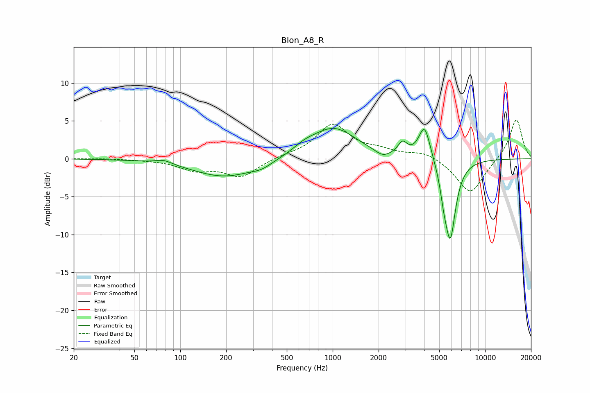

# Blon_A8_R
See [usage instructions](https://github.com/jaakkopasanen/AutoEq#usage) for more options and info.

### Parametric EQs
Apply preamp of -4.1 dB when using parametric equalizer.

|   # | Type    |   Fc (Hz) |    Q |   Gain (dB) |
|-----|---------|-----------|------|-------------|
|   1 | Peaking |        78 | 2.71 |         0.5 |
|   2 | Peaking |       197 | 0.67 |        -2.4 |
|   3 | Peaking |       342 | 2.23 |        -0.5 |
|   4 | Peaking |       653 | 1.82 |         0.8 |
|   5 | Peaking |      1016 | 0.96 |         4   |
|   6 | Peaking |      2125 | 3.03 |        -0.8 |
|   7 | Peaking |      2874 | 4.69 |         1.6 |
|   8 | Peaking |      4007 | 3.61 |         4.6 |
|   9 | Peaking |      5356 | 6    |        -2.1 |
|  10 | Peaking |      5906 | 3.78 |       -10.3 |

### Fixed Band EQs
When using fixed band (also called graphic) equalizer, apply preamp of **-5.2 dB** (if available) and set gains manually with these parameters.

|   # | Type    |   Fc (Hz) |    Q |   Gain (dB) |
|-----|---------|-----------|------|-------------|
|   1 | Peaking |        31 | 1.41 |         0.1 |
|   2 | Peaking |        62 | 1.41 |        -0.1 |
|   3 | Peaking |       125 | 1.41 |        -1.4 |
|   4 | Peaking |       250 | 1.41 |        -2.3 |
|   5 | Peaking |       500 | 1.41 |         0.3 |
|   6 | Peaking |      1000 | 1.41 |         4.4 |
|   7 | Peaking |      2000 | 1.41 |         0.9 |
|   8 | Peaking |      4000 | 1.41 |         0.9 |
|   9 | Peaking |      8000 | 1.41 |        -4.7 |
|  10 | Peaking |     16000 | 1.41 |         5.4 |

### Graphs

