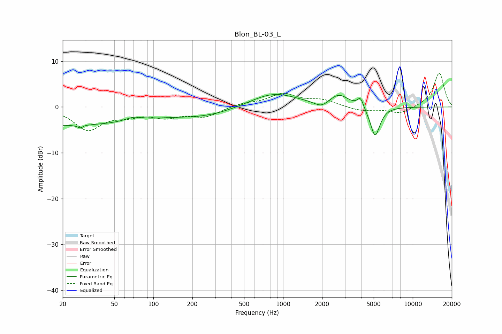

# Blon_BL-03_L
See [usage instructions](https://github.com/jaakkopasanen/AutoEq#usage) for more options and info.

### Parametric EQs
Apply preamp of -2.8 dB when using parametric equalizer.

|   # | Type    |   Fc (Hz) |    Q |   Gain (dB) |
|-----|---------|-----------|------|-------------|
|   1 | Peaking |        20 | 0.2  |        -4   |
|   2 | Peaking |        28 | 5.96 |        -3.9 |
|   3 | Peaking |        28 | 5.76 |         3.3 |
|   4 | Peaking |        70 | 2.25 |         0.9 |
|   5 | Peaking |       255 | 0.59 |        -1.8 |
|   6 | Peaking |       842 | 0.77 |         3.2 |
|   7 | Peaking |      1988 | 2.47 |        -1.4 |
|   8 | Peaking |      2685 | 1.88 |         2.6 |
|   9 | Peaking |      3952 | 5.99 |         2.2 |
|  10 | Peaking |      5125 | 3.73 |        -6.7 |

### Fixed Band EQs
When using fixed band (also called graphic) equalizer, apply preamp of **-7.5 dB** (if available) and set gains manually with these parameters.

|   # | Type    |   Fc (Hz) |    Q |   Gain (dB) |
|-----|---------|-----------|------|-------------|
|   1 | Peaking |        31 | 1.41 |        -4.8 |
|   2 | Peaking |        62 | 1.41 |        -1.4 |
|   3 | Peaking |       125 | 1.41 |        -1.9 |
|   4 | Peaking |       250 | 1.41 |        -2   |
|   5 | Peaking |       500 | 1.41 |         0.7 |
|   6 | Peaking |      1000 | 1.41 |         2.7 |
|   7 | Peaking |      2000 | 1.41 |         1.4 |
|   8 | Peaking |      4000 | 1.41 |        -0.9 |
|   9 | Peaking |      8000 | 1.41 |        -1.5 |
|  10 | Peaking |     16000 | 1.41 |         7.5 |

### Graphs

