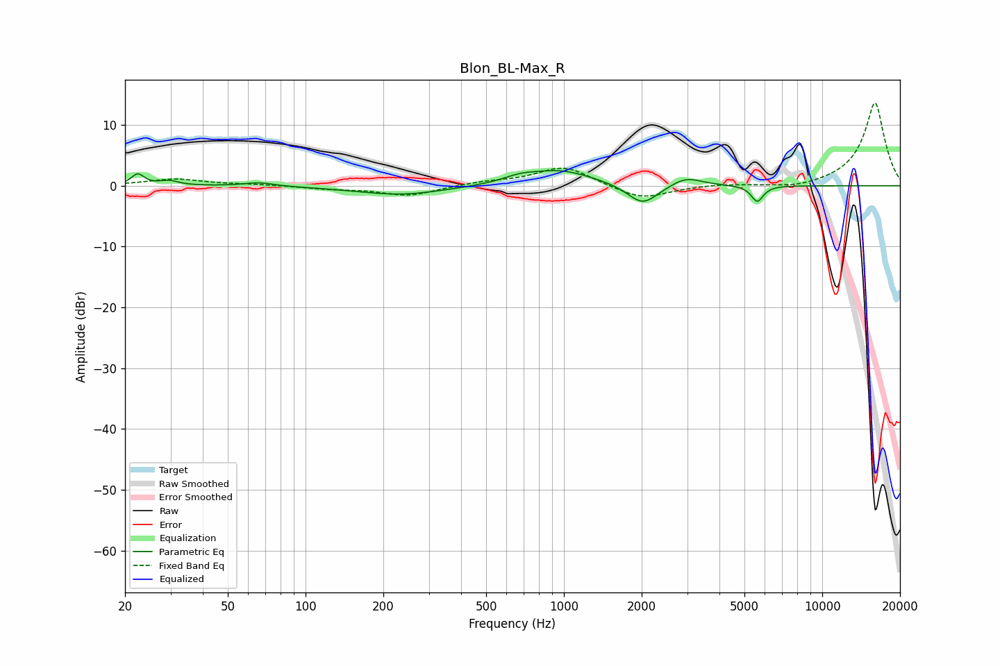

# Blon_BL-Max_R
See [usage instructions](https://github.com/jaakkopasanen/AutoEq#usage) for more options and info.

### Parametric EQs
Apply preamp of -2.6 dB when using parametric equalizer.

|   # | Type    |   Fc (Hz) |    Q |   Gain (dB) |
|-----|---------|-----------|------|-------------|
|   1 | Peaking |        22 | 5.99 |         1.8 |
|   2 | Peaking |        30 | 3.87 |         0.7 |
|   3 | Peaking |        66 | 2.49 |         0.6 |
|   4 | Peaking |       234 | 0.83 |        -1.5 |
|   5 | Peaking |       675 | 2.23 |         0.8 |
|   6 | Peaking |       967 | 1.1  |         2.5 |
|   7 | Peaking |      2007 | 2.49 |        -2.8 |
|   8 | Peaking |      2120 | 1.99 |        -0.7 |
|   9 | Peaking |      2964 | 2.31 |         1.5 |
|  10 | Peaking |      5604 | 6    |        -2.7 |

### Fixed Band EQs
When using fixed band (also called graphic) equalizer, apply preamp of **-13.7 dB** (if available) and set gains manually with these parameters.

|   # | Type    |   Fc (Hz) |    Q |   Gain (dB) |
|-----|---------|-----------|------|-------------|
|   1 | Peaking |        31 | 1.41 |         1.1 |
|   2 | Peaking |        62 | 1.41 |         0.2 |
|   3 | Peaking |       125 | 1.41 |        -0.5 |
|   4 | Peaking |       250 | 1.41 |        -1.6 |
|   5 | Peaking |       500 | 1.41 |         0.6 |
|   6 | Peaking |      1000 | 1.41 |         3.2 |
|   7 | Peaking |      2000 | 1.41 |        -2.3 |
|   8 | Peaking |      4000 | 1.41 |         0.3 |
|   9 | Peaking |      8000 | 1.41 |        -0.6 |
|  10 | Peaking |     16000 | 1.41 |        13.7 |

### Graphs

