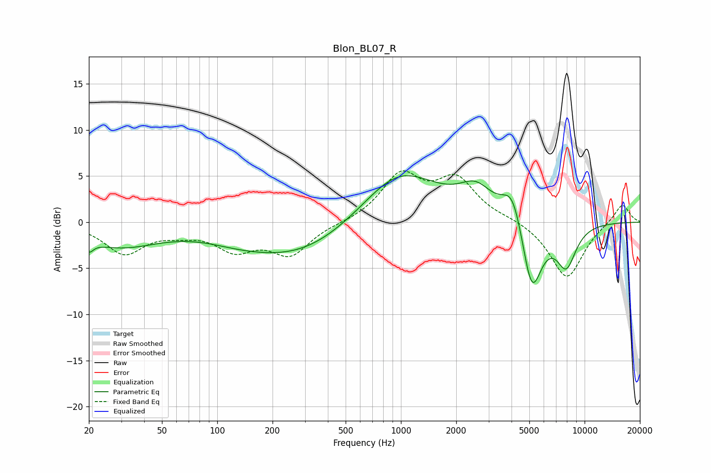

# Blon_BL07_R
See [usage instructions](https://github.com/jaakkopasanen/AutoEq#usage) for more options and info.

### Parametric EQs
Apply preamp of -5.1 dB when using parametric equalizer.

|   # | Type    |   Fc (Hz) |    Q |   Gain (dB) |
|-----|---------|-----------|------|-------------|
|   1 | Peaking |        20 | 5.94 |        -1.1 |
|   2 | Peaking |        29 | 0.66 |        -2.5 |
|   3 | Peaking |       126 | 0.94 |        -0.4 |
|   4 | Peaking |       280 | 0.43 |        -4   |
|   5 | Peaking |       681 | 0.98 |        -0.3 |
|   6 | Peaking |       951 | 0.64 |         6.3 |
|   7 | Peaking |      2558 | 1.59 |         2.7 |
|   8 | Peaking |      4062 | 2.45 |         4   |
|   9 | Peaking |      5154 | 2.47 |        -8.2 |
|  10 | Peaking |      7943 | 2.44 |        -4.4 |

### Fixed Band EQs
When using fixed band (also called graphic) equalizer, apply preamp of **-5.6 dB** (if available) and set gains manually with these parameters.

|   # | Type    |   Fc (Hz) |    Q |   Gain (dB) |
|-----|---------|-----------|------|-------------|
|   1 | Peaking |        31 | 1.41 |        -3.3 |
|   2 | Peaking |        62 | 1.41 |        -0.8 |
|   3 | Peaking |       125 | 1.41 |        -2.7 |
|   4 | Peaking |       250 | 1.41 |        -3.4 |
|   5 | Peaking |       500 | 1.41 |        -0.1 |
|   6 | Peaking |      1000 | 1.41 |         4.9 |
|   7 | Peaking |      2000 | 1.41 |         4.4 |
|   8 | Peaking |      4000 | 1.41 |         0.3 |
|   9 | Peaking |      8000 | 1.41 |        -6.1 |
|  10 | Peaking |     16000 | 1.41 |         2.1 |

### Graphs

