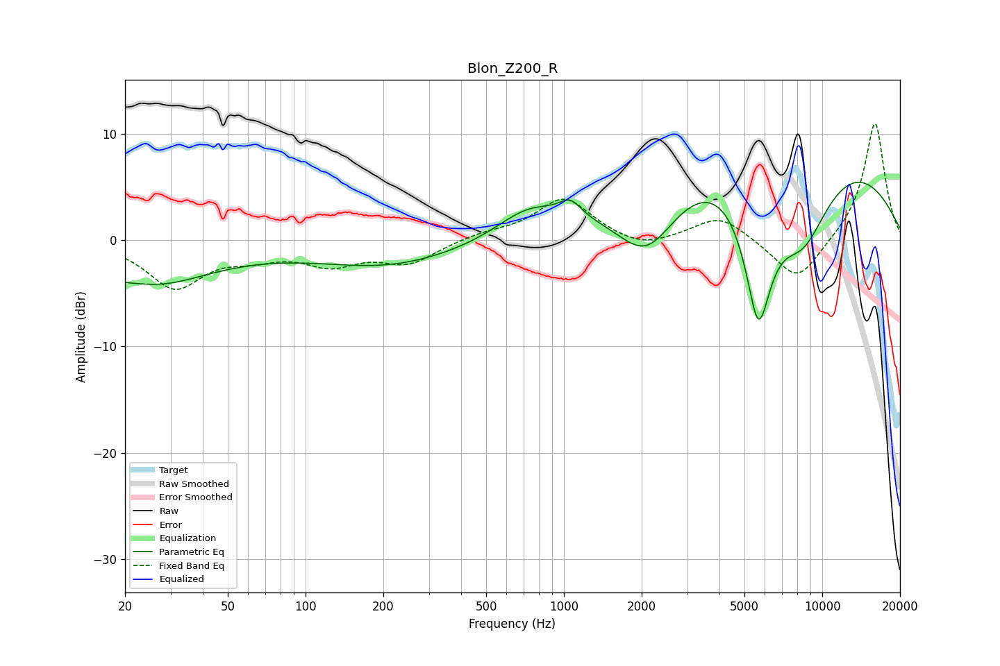

# Blon_Z200_R
See [usage instructions](https://github.com/jaakkopasanen/AutoEq#usage) for more options and info.

### Parametric EQs
Apply preamp of -5.6 dB when using parametric equalizer.

|   # | Type    |   Fc (Hz) |    Q |   Gain (dB) |
|-----|---------|-----------|------|-------------|
|   1 | Peaking |        20 | 4.32 |        -0.3 |
|   2 | Peaking |        25 | 0.65 |        -3.8 |
|   3 | Peaking |       209 | 0.56 |        -1.7 |
|   4 | Peaking |       223 | 0.18 |        -0.8 |
|   5 | Peaking |       729 | 1.13 |         2.6 |
|   6 | Peaking |      1059 | 3.37 |         1.5 |
|   7 | Peaking |      2092 | 1.13 |        -6.7 |
|   8 | Peaking |      5658 | 2.33 |       -13.7 |
|   9 | Peaking |      6669 | 0.25 |        11.8 |
|  10 | Peaking |      8383 | 1.04 |        -9.3 |

### Fixed Band EQs
When using fixed band (also called graphic) equalizer, apply preamp of **-11.1 dB** (if available) and set gains manually with these parameters.

|   # | Type    |   Fc (Hz) |    Q |   Gain (dB) |
|-----|---------|-----------|------|-------------|
|   1 | Peaking |        31 | 1.41 |        -4.3 |
|   2 | Peaking |        62 | 1.41 |        -1.2 |
|   3 | Peaking |       125 | 1.41 |        -2   |
|   4 | Peaking |       250 | 1.41 |        -2.1 |
|   5 | Peaking |       500 | 1.41 |         0.6 |
|   6 | Peaking |      1000 | 1.41 |         4   |
|   7 | Peaking |      2000 | 1.41 |        -1   |
|   8 | Peaking |      4000 | 1.41 |         2.3 |
|   9 | Peaking |      8000 | 1.41 |        -4.1 |
|  10 | Peaking |     16000 | 1.41 |        11.2 |

### Graphs

