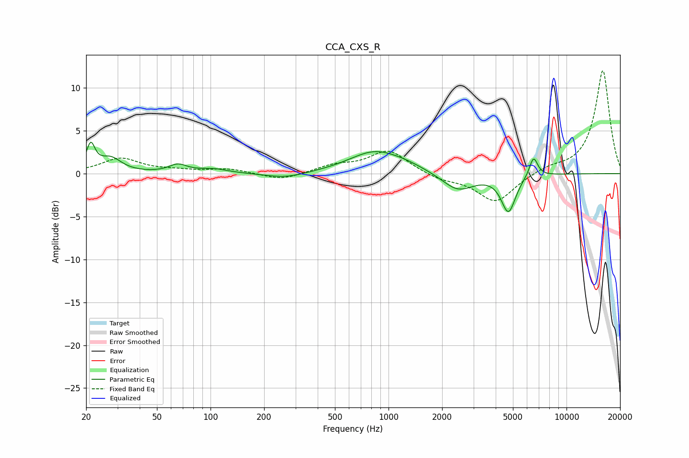

# CCA_CXS_R
See [usage instructions](https://github.com/jaakkopasanen/AutoEq#usage) for more options and info.

### Parametric EQs
Apply preamp of -3.8 dB when using parametric equalizer.

|   # | Type    |   Fc (Hz) |    Q |   Gain (dB) |
|-----|---------|-----------|------|-------------|
|   1 | Peaking |        21 | 6    |         2.9 |
|   2 | Peaking |        27 | 2.33 |         1.7 |
|   3 | Peaking |        66 | 2.87 |         0.9 |
|   4 | Peaking |       103 | 1.74 |         0.5 |
|   5 | Peaking |       263 | 1.25 |        -0.6 |
|   6 | Peaking |       834 | 0.98 |         2.5 |
|   7 | Peaking |      1262 | 1.29 |         0.5 |
|   8 | Peaking |      2453 | 1.58 |        -2.1 |
|   9 | Peaking |      4717 | 3.51 |        -4.3 |
|  10 | Peaking |      6525 | 5.75 |         2.4 |

### Fixed Band EQs
When using fixed band (also called graphic) equalizer, apply preamp of **-12.1 dB** (if available) and set gains manually with these parameters.

|   # | Type    |   Fc (Hz) |    Q |   Gain (dB) |
|-----|---------|-----------|------|-------------|
|   1 | Peaking |        31 | 1.41 |         1.7 |
|   2 | Peaking |        62 | 1.41 |         0.3 |
|   3 | Peaking |       125 | 1.41 |         0.5 |
|   4 | Peaking |       250 | 1.41 |        -0.8 |
|   5 | Peaking |       500 | 1.41 |         0.9 |
|   6 | Peaking |      1000 | 1.41 |         2.7 |
|   7 | Peaking |      2000 | 1.41 |        -0.7 |
|   8 | Peaking |      4000 | 1.41 |        -3.4 |
|   9 | Peaking |      8000 | 1.41 |         0.6 |
|  10 | Peaking |     16000 | 1.41 |        12.1 |

### Graphs

