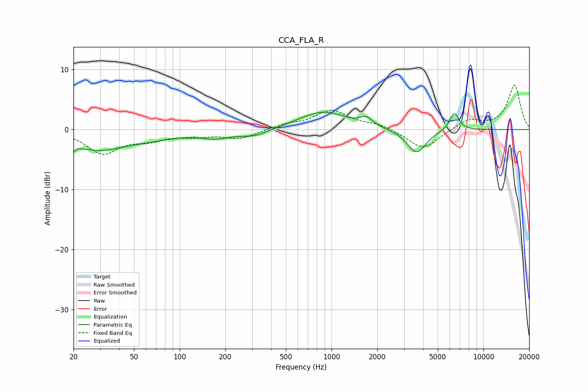

# CCA_FLA_R
See [usage instructions](https://github.com/jaakkopasanen/AutoEq#usage) for more options and info.

### Parametric EQs
Apply preamp of -3.0 dB when using parametric equalizer.

|   # | Type    |   Fc (Hz) |    Q |   Gain (dB) |
|-----|---------|-----------|------|-------------|
|   1 | Peaking |        20 | 4.82 |        -3.6 |
|   2 | Peaking |        21 | 5.58 |         2.3 |
|   3 | Peaking |        29 | 0.8  |        -3   |
|   4 | Peaking |        66 | 0.81 |        -1   |
|   5 | Peaking |       172 | 1.47 |        -1.1 |
|   6 | Peaking |       309 | 1.51 |        -1.1 |
|   7 | Peaking |       876 | 0.92 |         3   |
|   8 | Peaking |      1691 | 3.61 |         1.3 |
|   9 | Peaking |      3629 | 2.25 |        -4   |
|  10 | Peaking |      6431 | 4.32 |         3   |

### Fixed Band EQs
When using fixed band (also called graphic) equalizer, apply preamp of **-7.5 dB** (if available) and set gains manually with these parameters.

|   # | Type    |   Fc (Hz) |    Q |   Gain (dB) |
|-----|---------|-----------|------|-------------|
|   1 | Peaking |        31 | 1.41 |        -3.8 |
|   2 | Peaking |        62 | 1.41 |        -1.4 |
|   3 | Peaking |       125 | 1.41 |        -0.8 |
|   4 | Peaking |       250 | 1.41 |        -1.5 |
|   5 | Peaking |       500 | 1.41 |         0.8 |
|   6 | Peaking |      1000 | 1.41 |         3.1 |
|   7 | Peaking |      2000 | 1.41 |         0.9 |
|   8 | Peaking |      4000 | 1.41 |        -3.4 |
|   9 | Peaking |      8000 | 1.41 |         1.7 |
|  10 | Peaking |     16000 | 1.41 |         7.4 |

### Graphs

