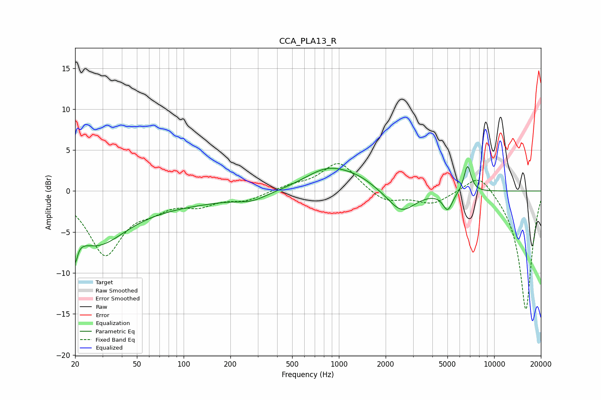

# CCA_PLA13_R
See [usage instructions](https://github.com/jaakkopasanen/AutoEq#usage) for more options and info.

### Parametric EQs
Apply preamp of -3.1 dB when using parametric equalizer.

|   # | Type    |   Fc (Hz) |    Q |   Gain (dB) |
|-----|---------|-----------|------|-------------|
|   1 | Peaking |        20 | 5.94 |        -6.9 |
|   2 | Peaking |        20 | 5.83 |         3.3 |
|   3 | Peaking |        27 | 0.78 |        -5.3 |
|   4 | Peaking |        70 | 0.28 |        -1.5 |
|   5 | Peaking |       276 | 1.53 |        -0.7 |
|   6 | Peaking |       856 | 0.92 |         2.7 |
|   7 | Peaking |      1339 | 1.3  |         0.8 |
|   8 | Peaking |      2528 | 1.61 |        -2.8 |
|   9 | Peaking |      5020 | 4.45 |        -2.2 |
|  10 | Peaking |      6738 | 5.85 |         3.3 |

### Fixed Band EQs
When using fixed band (also called graphic) equalizer, apply preamp of **-3.4 dB** (if available) and set gains manually with these parameters.

|   # | Type    |   Fc (Hz) |    Q |   Gain (dB) |
|-----|---------|-----------|------|-------------|
|   1 | Peaking |        31 | 1.41 |        -7.6 |
|   2 | Peaking |        62 | 1.41 |        -1.5 |
|   3 | Peaking |       125 | 1.41 |        -1.4 |
|   4 | Peaking |       250 | 1.41 |        -1   |
|   5 | Peaking |       500 | 1.41 |         0.6 |
|   6 | Peaking |      1000 | 1.41 |         3.6 |
|   7 | Peaking |      2000 | 1.41 |        -1.4 |
|   8 | Peaking |      4000 | 1.41 |        -1.5 |
|   9 | Peaking |      8000 | 1.41 |         2.6 |
|  10 | Peaking |     16000 | 1.41 |       -14.6 |

### Graphs

