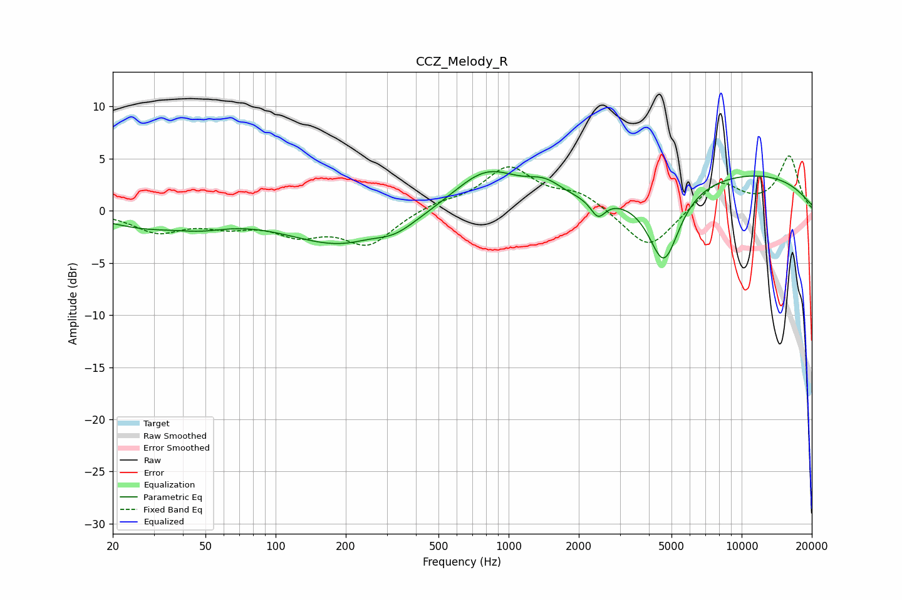

# CCZ_Melody_R
See [usage instructions](https://github.com/jaakkopasanen/AutoEq#usage) for more options and info.

### Parametric EQs
Apply preamp of -3.9 dB when using parametric equalizer.

|   # | Type    |   Fc (Hz) |    Q |   Gain (dB) |
|-----|---------|-----------|------|-------------|
|   1 | Peaking |        27 | 0.84 |        -1.3 |
|   2 | Peaking |        48 | 1.27 |        -0.8 |
|   3 | Peaking |       194 | 0.61 |        -3.2 |
|   4 | Peaking |       253 | 2    |         0.2 |
|   5 | Peaking |       327 | 1.69 |        -0.8 |
|   6 | Peaking |       802 | 0.99 |         3.9 |
|   7 | Peaking |      1430 | 1.86 |         1.4 |
|   8 | Peaking |      2418 | 4.6  |        -1.7 |
|   9 | Peaking |      4639 | 2.13 |        -7.2 |
|  10 | Peaking |     10000 | 0.3  |         3.6 |

### Fixed Band EQs
When using fixed band (also called graphic) equalizer, apply preamp of **-5.4 dB** (if available) and set gains manually with these parameters.

|   # | Type    |   Fc (Hz) |    Q |   Gain (dB) |
|-----|---------|-----------|------|-------------|
|   1 | Peaking |        31 | 1.41 |        -1.9 |
|   2 | Peaking |        62 | 1.41 |        -1.2 |
|   3 | Peaking |       125 | 1.41 |        -1.9 |
|   4 | Peaking |       250 | 1.41 |        -3.1 |
|   5 | Peaking |       500 | 1.41 |         0.7 |
|   6 | Peaking |      1000 | 1.41 |         4   |
|   7 | Peaking |      2000 | 1.41 |         1.6 |
|   8 | Peaking |      4000 | 1.41 |        -3.9 |
|   9 | Peaking |      8000 | 1.41 |         2.8 |
|  10 | Peaking |     16000 | 1.41 |         5.2 |

### Graphs

