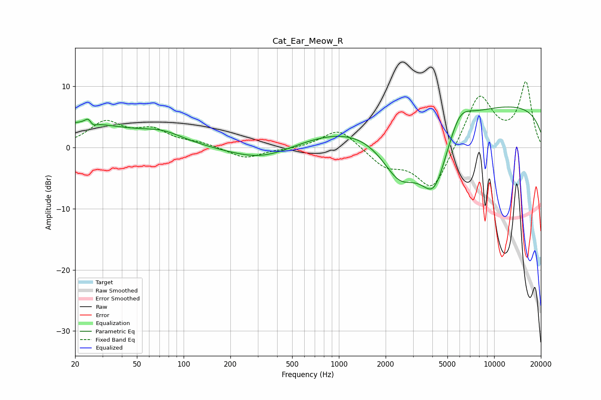

# Cat_Ear_Meow_R
See [usage instructions](https://github.com/jaakkopasanen/AutoEq#usage) for more options and info.

### Parametric EQs
Apply preamp of -6.7 dB when using parametric equalizer.

|   # | Type    |   Fc (Hz) |    Q |   Gain (dB) |
|-----|---------|-----------|------|-------------|
|   1 | Peaking |        20 | 0.4  |         3.9 |
|   2 | Peaking |        25 | 5.88 |         3.1 |
|   3 | Peaking |        25 | 5.91 |        -2.8 |
|   4 | Peaking |        74 | 1.03 |         1.6 |
|   5 | Peaking |       322 | 0.69 |        -2.4 |
|   6 | Peaking |      1316 | 0.38 |         3.1 |
|   7 | Peaking |      2456 | 1.08 |        -8.4 |
|   8 | Peaking |      4108 | 1.36 |       -11.2 |
|   9 | Peaking |      5979 | 1.85 |         3.8 |
|  10 | Peaking |     10000 | 0.18 |         7.1 |

### Fixed Band EQs
When using fixed band (also called graphic) equalizer, apply preamp of **-10.8 dB** (if available) and set gains manually with these parameters.

|   # | Type    |   Fc (Hz) |    Q |   Gain (dB) |
|-----|---------|-----------|------|-------------|
|   1 | Peaking |        31 | 1.41 |         3.9 |
|   2 | Peaking |        62 | 1.41 |         2.6 |
|   3 | Peaking |       125 | 1.41 |         0.6 |
|   4 | Peaking |       250 | 1.41 |        -1.8 |
|   5 | Peaking |       500 | 1.41 |        -0.2 |
|   6 | Peaking |      1000 | 1.41 |         3.3 |
|   7 | Peaking |      2000 | 1.41 |        -2.8 |
|   8 | Peaking |      4000 | 1.41 |        -7.3 |
|   9 | Peaking |      8000 | 1.41 |         8.9 |
|  10 | Peaking |     16000 | 1.41 |        10.4 |

### Graphs

