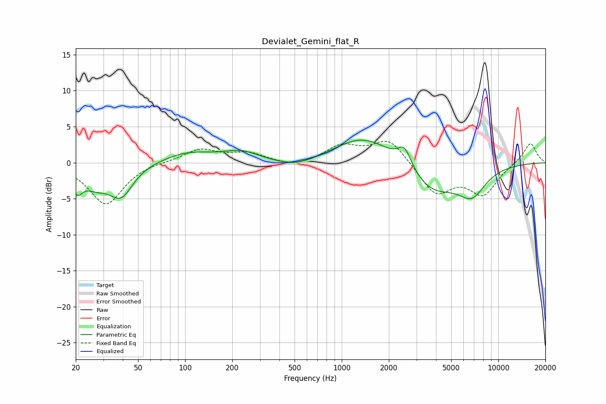

# Devialet_Gemini_flat_R
See [usage instructions](https://github.com/jaakkopasanen/AutoEq#usage) for more options and info.

### Parametric EQs
Apply preamp of -3.2 dB when using parametric equalizer.

|   # | Type    |   Fc (Hz) |    Q |   Gain (dB) |
|-----|---------|-----------|------|-------------|
|   1 | Peaking |        20 | 4.34 |        -2.6 |
|   2 | Peaking |        27 | 1.6  |        -2.5 |
|   3 | Peaking |        39 | 1.89 |        -4.1 |
|   4 | Peaking |       104 | 0.88 |         1.4 |
|   5 | Peaking |       229 | 1.2  |         1.4 |
|   6 | Peaking |       513 | 1.01 |        -1.1 |
|   7 | Peaking |      1412 | 0.73 |         4   |
|   8 | Peaking |      2518 | 3.19 |         2.8 |
|   9 | Peaking |      3765 | 0.85 |        -4.3 |
|  10 | Peaking |      6794 | 1.6  |        -3.5 |

### Fixed Band EQs
When using fixed band (also called graphic) equalizer, apply preamp of **-3.1 dB** (if available) and set gains manually with these parameters.

|   # | Type    |   Fc (Hz) |    Q |   Gain (dB) |
|-----|---------|-----------|------|-------------|
|   1 | Peaking |        31 | 1.41 |        -5.8 |
|   2 | Peaking |        62 | 1.41 |         0.2 |
|   3 | Peaking |       125 | 1.41 |         1.8 |
|   4 | Peaking |       250 | 1.41 |         1.3 |
|   5 | Peaking |       500 | 1.41 |        -0.7 |
|   6 | Peaking |      1000 | 1.41 |         2.2 |
|   7 | Peaking |      2000 | 1.41 |         3.4 |
|   8 | Peaking |      4000 | 1.41 |        -4.3 |
|   9 | Peaking |      8000 | 1.41 |        -4.2 |
|  10 | Peaking |     16000 | 1.41 |         2.9 |

### Graphs

