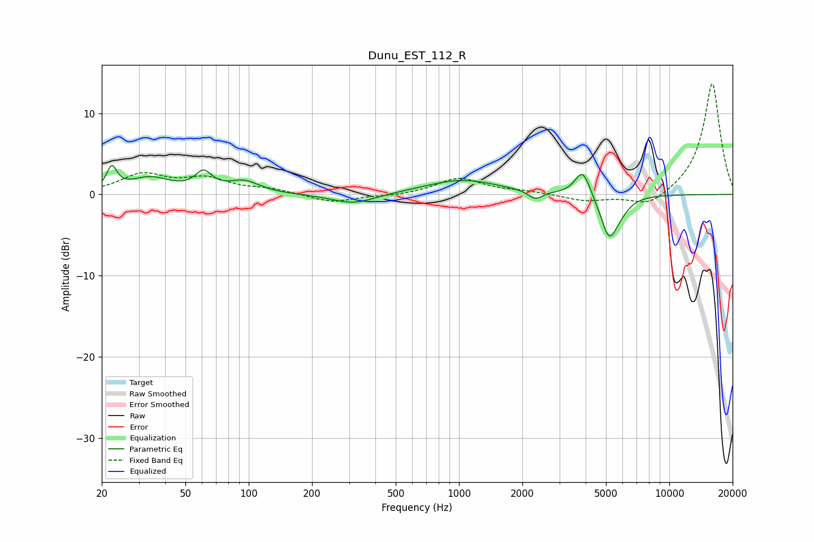

# Dunu_EST_112_R
See [usage instructions](https://github.com/jaakkopasanen/AutoEq#usage) for more options and info.

### Parametric EQs
Apply preamp of -3.7 dB when using parametric equalizer.

|   # | Type    |   Fc (Hz) |    Q |   Gain (dB) |
|-----|---------|-----------|------|-------------|
|   1 | Peaking |        22 | 5.98 |         2.7 |
|   2 | Peaking |        34 | 1.44 |         1.9 |
|   3 | Peaking |        61 | 3.6  |         2.2 |
|   4 | Peaking |        95 | 1.93 |         1.5 |
|   5 | Peaking |       315 | 1.35 |        -1.3 |
|   6 | Peaking |      1033 | 0.81 |         1.8 |
|   7 | Peaking |      2307 | 4.22 |        -1.1 |
|   8 | Peaking |      3875 | 3.86 |         3.3 |
|   9 | Peaking |      5172 | 3.44 |        -5.2 |
|  10 | Peaking |      5882 | 3.06 |        -0.9 |

### Fixed Band EQs
When using fixed band (also called graphic) equalizer, apply preamp of **-13.7 dB** (if available) and set gains manually with these parameters.

|   # | Type    |   Fc (Hz) |    Q |   Gain (dB) |
|-----|---------|-----------|------|-------------|
|   1 | Peaking |        31 | 1.41 |         2.3 |
|   2 | Peaking |        62 | 1.41 |         1.8 |
|   3 | Peaking |       125 | 1.41 |         0.6 |
|   4 | Peaking |       250 | 1.41 |        -1   |
|   5 | Peaking |       500 | 1.41 |        -0.2 |
|   6 | Peaking |      1000 | 1.41 |         2   |
|   7 | Peaking |      2000 | 1.41 |         0.3 |
|   8 | Peaking |      4000 | 1.41 |        -0.8 |
|   9 | Peaking |      8000 | 1.41 |        -1.7 |
|  10 | Peaking |     16000 | 1.41 |        13.8 |

### Graphs

