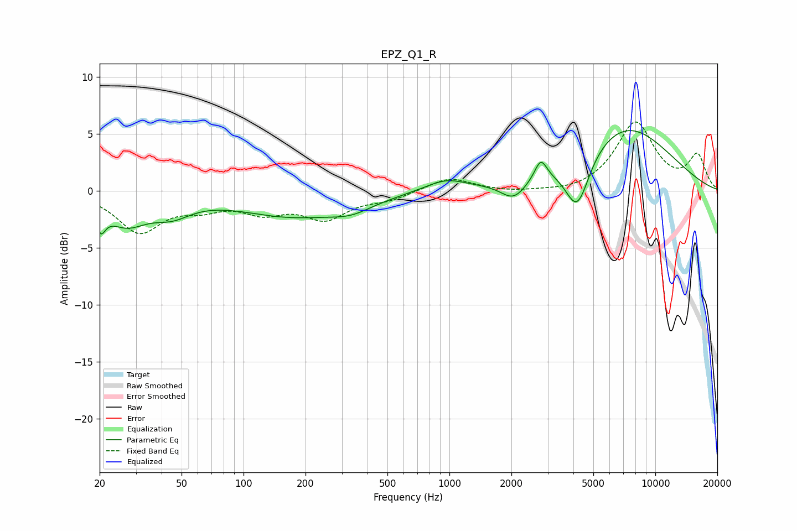

# EPZ_Q1_R
See [usage instructions](https://github.com/jaakkopasanen/AutoEq#usage) for more options and info.

### Parametric EQs
Apply preamp of -5.4 dB when using parametric equalizer.

|   # | Type    |   Fc (Hz) |    Q |   Gain (dB) |
|-----|---------|-----------|------|-------------|
|   1 | Peaking |        20 | 5.98 |        -1.9 |
|   2 | Peaking |        27 | 1.4  |        -2.5 |
|   3 | Peaking |        45 | 1.45 |        -1.4 |
|   4 | Peaking |       174 | 0.53 |        -2.1 |
|   5 | Peaking |       334 | 1.37 |        -0.8 |
|   6 | Peaking |       957 | 1.4  |         1   |
|   7 | Peaking |      2050 | 2.28 |        -1.6 |
|   8 | Peaking |      2778 | 4.75 |         1.8 |
|   9 | Peaking |      4180 | 2.38 |        -4.8 |
|  10 | Peaking |      7054 | 0.56 |         5.7 |

### Fixed Band EQs
When using fixed band (also called graphic) equalizer, apply preamp of **-6.1 dB** (if available) and set gains manually with these parameters.

|   # | Type    |   Fc (Hz) |    Q |   Gain (dB) |
|-----|---------|-----------|------|-------------|
|   1 | Peaking |        31 | 1.41 |        -3.5 |
|   2 | Peaking |        62 | 1.41 |        -1.1 |
|   3 | Peaking |       125 | 1.41 |        -1.6 |
|   4 | Peaking |       250 | 1.41 |        -2.2 |
|   5 | Peaking |       500 | 1.41 |        -0.7 |
|   6 | Peaking |      1000 | 1.41 |         1.2 |
|   7 | Peaking |      2000 | 1.41 |        -0.2 |
|   8 | Peaking |      4000 | 1.41 |        -0.3 |
|   9 | Peaking |      8000 | 1.41 |         5.9 |
|  10 | Peaking |     16000 | 1.41 |         3   |

### Graphs

