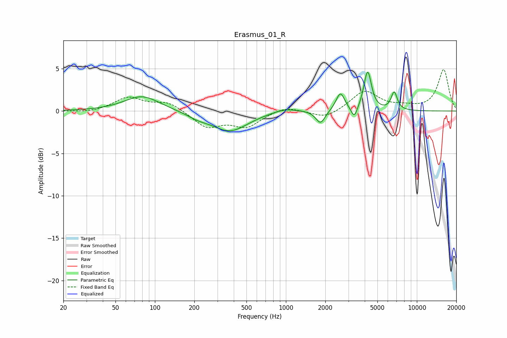

# Erasmus_01_R
See [usage instructions](https://github.com/jaakkopasanen/AutoEq#usage) for more options and info.

### Parametric EQs
Apply preamp of -4.7 dB when using parametric equalizer.

|   # | Type    |   Fc (Hz) |    Q |   Gain (dB) |
|-----|---------|-----------|------|-------------|
|   1 | Peaking |        80 | 1.06 |         1.8 |
|   2 | Peaking |       212 | 1.76 |        -0.5 |
|   3 | Peaking |       373 | 1.03 |        -2.3 |
|   4 | Peaking |       987 | 1.44 |         0.5 |
|   5 | Peaking |      1838 | 4.06 |        -1.6 |
|   6 | Peaking |      2605 | 4.32 |         2.1 |
|   7 | Peaking |      3327 | 6    |        -1.4 |
|   8 | Peaking |      4188 | 5.02 |         3.8 |
|   9 | Peaking |      4295 | 5.44 |         0.9 |
|  10 | Peaking |      6714 | 5.92 |         2.1 |

### Fixed Band EQs
When using fixed band (also called graphic) equalizer, apply preamp of **-5.0 dB** (if available) and set gains manually with these parameters.

|   # | Type    |   Fc (Hz) |    Q |   Gain (dB) |
|-----|---------|-----------|------|-------------|
|   1 | Peaking |        31 | 1.41 |        -0.2 |
|   2 | Peaking |        62 | 1.41 |         1.6 |
|   3 | Peaking |       125 | 1.41 |         1.1 |
|   4 | Peaking |       250 | 1.41 |        -1.9 |
|   5 | Peaking |       500 | 1.41 |        -1.8 |
|   6 | Peaking |      1000 | 1.41 |         0.6 |
|   7 | Peaking |      2000 | 1.41 |        -0.9 |
|   8 | Peaking |      4000 | 1.41 |         2.4 |
|   9 | Peaking |      8000 | 1.41 |         0.4 |
|  10 | Peaking |     16000 | 1.41 |         4.9 |

### Graphs

