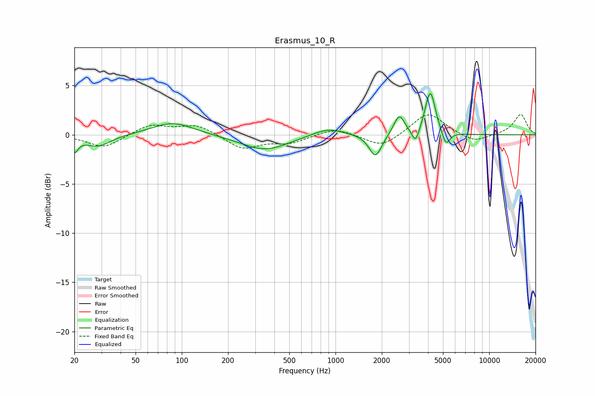

# Erasmus_10_R
See [usage instructions](https://github.com/jaakkopasanen/AutoEq#usage) for more options and info.

### Parametric EQs
Apply preamp of -4.3 dB when using parametric equalizer.

|   # | Type    |   Fc (Hz) |    Q |   Gain (dB) |
|-----|---------|-----------|------|-------------|
|   1 | Peaking |        20 | 6    |        -1.4 |
|   2 | Peaking |        28 | 1.67 |        -1.2 |
|   3 | Peaking |        87 | 1.06 |         1.3 |
|   4 | Peaking |       346 | 0.93 |        -1.6 |
|   5 | Peaking |       891 | 1.42 |         0.8 |
|   6 | Peaking |      1819 | 3.5  |        -2.4 |
|   7 | Peaking |      2595 | 4.06 |         2   |
|   8 | Peaking |      3319 | 5.99 |        -1.5 |
|   9 | Peaking |      4136 | 4.27 |         4.5 |
|  10 | Peaking |      5224 | 5.44 |        -1.5 |

### Fixed Band EQs
When using fixed band (also called graphic) equalizer, apply preamp of **-2.2 dB** (if available) and set gains manually with these parameters.

|   # | Type    |   Fc (Hz) |    Q |   Gain (dB) |
|-----|---------|-----------|------|-------------|
|   1 | Peaking |        31 | 1.41 |        -1.3 |
|   2 | Peaking |        62 | 1.41 |         1   |
|   3 | Peaking |       125 | 1.41 |         1   |
|   4 | Peaking |       250 | 1.41 |        -1.4 |
|   5 | Peaking |       500 | 1.41 |        -0.8 |
|   6 | Peaking |      1000 | 1.41 |         0.7 |
|   7 | Peaking |      2000 | 1.41 |        -1.3 |
|   8 | Peaking |      4000 | 1.41 |         2.3 |
|   9 | Peaking |      8000 | 1.41 |        -0.8 |
|  10 | Peaking |     16000 | 1.41 |         2.1 |

### Graphs

