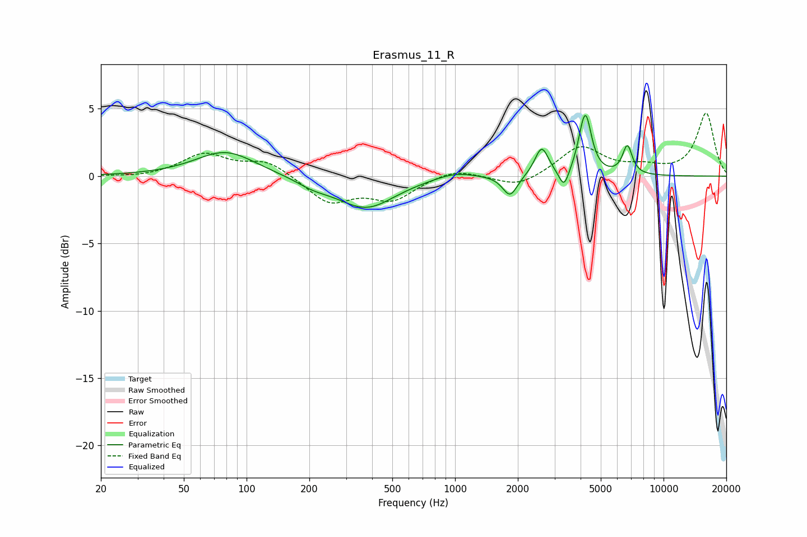

# Erasmus_11_R
See [usage instructions](https://github.com/jaakkopasanen/AutoEq#usage) for more options and info.

### Parametric EQs
Apply preamp of -4.6 dB when using parametric equalizer.

|   # | Type    |   Fc (Hz) |    Q |   Gain (dB) |
|-----|---------|-----------|------|-------------|
|   1 | Peaking |        79 | 0.99 |         1.9 |
|   2 | Peaking |       209 | 1.72 |        -0.5 |
|   3 | Peaking |       374 | 1.02 |        -2.4 |
|   4 | Peaking |       997 | 1.48 |         0.5 |
|   5 | Peaking |      1836 | 4.04 |        -1.6 |
|   6 | Peaking |      2603 | 4.37 |         2.1 |
|   7 | Peaking |      3331 | 6    |        -1.4 |
|   8 | Peaking |      4071 | 5.32 |         0.9 |
|   9 | Peaking |      4240 | 5.07 |         3.8 |
|  10 | Peaking |      6706 | 5.91 |         2.1 |

### Fixed Band EQs
When using fixed band (also called graphic) equalizer, apply preamp of **-4.8 dB** (if available) and set gains manually with these parameters.

|   # | Type    |   Fc (Hz) |    Q |   Gain (dB) |
|-----|---------|-----------|------|-------------|
|   1 | Peaking |        31 | 1.41 |        -0.1 |
|   2 | Peaking |        62 | 1.41 |         1.6 |
|   3 | Peaking |       125 | 1.41 |         1.1 |
|   4 | Peaking |       250 | 1.41 |        -1.9 |
|   5 | Peaking |       500 | 1.41 |        -1.7 |
|   6 | Peaking |      1000 | 1.41 |         0.6 |
|   7 | Peaking |      2000 | 1.41 |        -0.9 |
|   8 | Peaking |      4000 | 1.41 |         2.2 |
|   9 | Peaking |      8000 | 1.41 |         0.5 |
|  10 | Peaking |     16000 | 1.41 |         4.7 |

### Graphs

