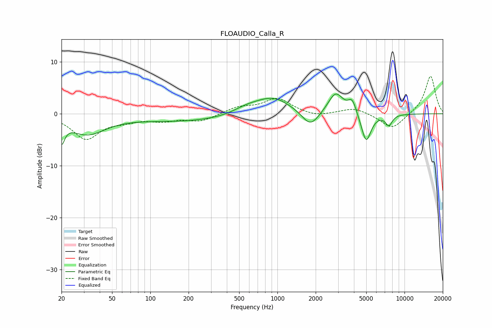

# FLOAUDIO_Calla_R
See [usage instructions](https://github.com/jaakkopasanen/AutoEq#usage) for more options and info.

### Parametric EQs
Apply preamp of -3.9 dB when using parametric equalizer.

|   # | Type    |   Fc (Hz) |    Q |   Gain (dB) |
|-----|---------|-----------|------|-------------|
|   1 | Peaking |        20 | 5.85 |        -3.8 |
|   2 | Peaking |        32 | 0.98 |        -3.7 |
|   3 | Peaking |       196 | 0.35 |        -1.4 |
|   4 | Peaking |       571 | 1.32 |         1.1 |
|   5 | Peaking |       921 | 1    |         3.2 |
|   6 | Peaking |      1818 | 2.12 |        -3.2 |
|   7 | Peaking |      2871 | 2.39 |         4.1 |
|   8 | Peaking |      3879 | 4.38 |         2.6 |
|   9 | Peaking |      4991 | 3.63 |        -5.7 |
|  10 | Peaking |      7532 | 4.86 |        -2   |

### Fixed Band EQs
When using fixed band (also called graphic) equalizer, apply preamp of **-7.3 dB** (if available) and set gains manually with these parameters.

|   # | Type    |   Fc (Hz) |    Q |   Gain (dB) |
|-----|---------|-----------|------|-------------|
|   1 | Peaking |        31 | 1.41 |        -4.7 |
|   2 | Peaking |        62 | 1.41 |        -1   |
|   3 | Peaking |       125 | 1.41 |        -1.1 |
|   4 | Peaking |       250 | 1.41 |        -1.4 |
|   5 | Peaking |       500 | 1.41 |         1.2 |
|   6 | Peaking |      1000 | 1.41 |         2.9 |
|   7 | Peaking |      2000 | 1.41 |        -0.6 |
|   8 | Peaking |      4000 | 1.41 |         1.2 |
|   9 | Peaking |      8000 | 1.41 |        -3   |
|  10 | Peaking |     16000 | 1.41 |         7.4 |

### Graphs

