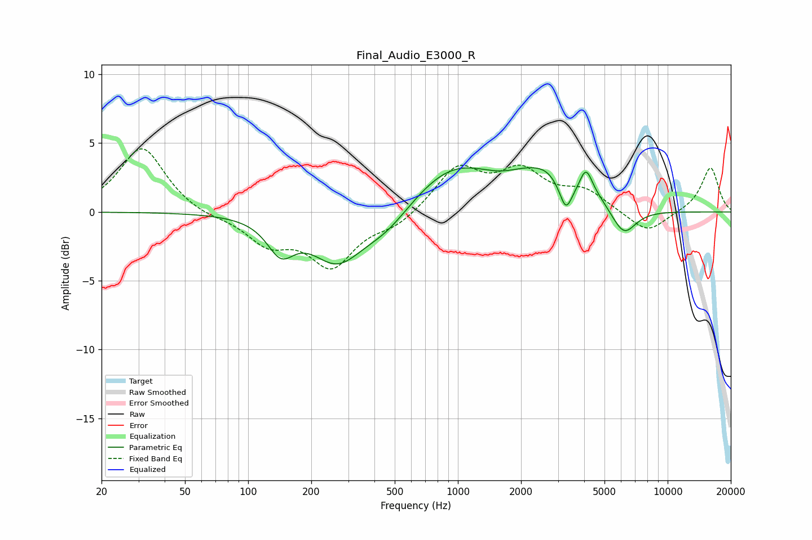

# Final_Audio_E3000_R
See [usage instructions](https://github.com/jaakkopasanen/AutoEq#usage) for more options and info.

### Parametric EQs
Apply preamp of -3.3 dB when using parametric equalizer.

|   # | Type    |   Fc (Hz) |    Q |   Gain (dB) |
|-----|---------|-----------|------|-------------|
|   1 | Peaking |       143 | 2.21 |        -2.4 |
|   2 | Peaking |       266 | 1.15 |        -3.5 |
|   3 | Peaking |       456 | 1.14 |        -1.6 |
|   4 | Peaking |       967 | 0.68 |         3.5 |
|   5 | Peaking |      2021 | 1.7  |         0.7 |
|   6 | Peaking |      2640 | 1.56 |         1.9 |
|   7 | Peaking |      3268 | 4.88 |        -1.9 |
|   8 | Peaking |      4080 | 4.34 |         2.2 |
|   9 | Peaking |      4737 | 2.92 |         0.4 |
|  10 | Peaking |      6193 | 2.42 |        -1.9 |

### Fixed Band EQs
When using fixed band (also called graphic) equalizer, apply preamp of **-4.7 dB** (if available) and set gains manually with these parameters.

|   # | Type    |   Fc (Hz) |    Q |   Gain (dB) |
|-----|---------|-----------|------|-------------|
|   1 | Peaking |        31 | 1.41 |         4.8 |
|   2 | Peaking |        62 | 1.41 |        -0.4 |
|   3 | Peaking |       125 | 1.41 |        -2.1 |
|   4 | Peaking |       250 | 1.41 |        -3.7 |
|   5 | Peaking |       500 | 1.41 |        -0.9 |
|   6 | Peaking |      1000 | 1.41 |         3.1 |
|   7 | Peaking |      2000 | 1.41 |         2.7 |
|   8 | Peaking |      4000 | 1.41 |         1.4 |
|   9 | Peaking |      8000 | 1.41 |        -1.6 |
|  10 | Peaking |     16000 | 1.41 |         3.3 |

### Graphs

