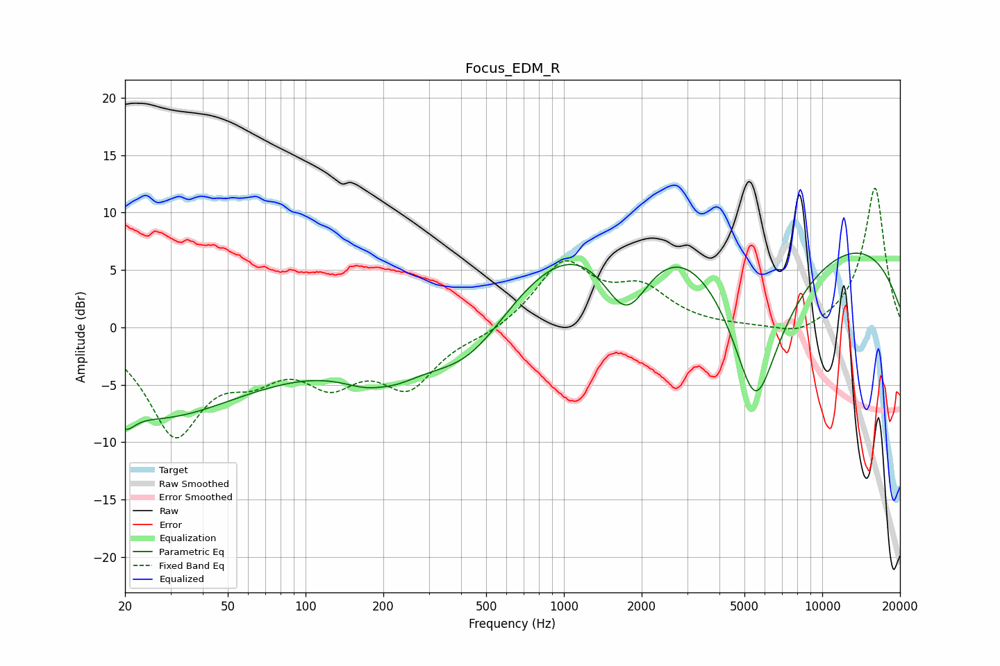

# Focus_EDM_R
See [usage instructions](https://github.com/jaakkopasanen/AutoEq#usage) for more options and info.

### Parametric EQs
Apply preamp of -6.6 dB when using parametric equalizer.

|   # | Type    |   Fc (Hz) |    Q |   Gain (dB) |
|-----|---------|-----------|------|-------------|
|   1 | Peaking |        20 | 3.92 |        -1.7 |
|   2 | Peaking |        25 | 0.45 |        -6.9 |
|   3 | Peaking |        96 | 0.34 |        -1.9 |
|   4 | Peaking |       196 | 1.32 |        -5.1 |
|   5 | Peaking |       196 | 1.81 |         2.4 |
|   6 | Peaking |       430 | 0.79 |        -5.2 |
|   7 | Peaking |      1563 | 0.31 |         6.9 |
|   8 | Peaking |      1744 | 1.32 |        -8.8 |
|   9 | Peaking |      5513 | 0.92 |       -20   |
|  10 | Peaking |      6323 | 0.18 |        12   |

### Fixed Band EQs
When using fixed band (also called graphic) equalizer, apply preamp of **-12.2 dB** (if available) and set gains manually with these parameters.

|   # | Type    |   Fc (Hz) |    Q |   Gain (dB) |
|-----|---------|-----------|------|-------------|
|   1 | Peaking |        31 | 1.41 |        -8.9 |
|   2 | Peaking |        62 | 1.41 |        -2.9 |
|   3 | Peaking |       125 | 1.41 |        -3.9 |
|   4 | Peaking |       250 | 1.41 |        -4.7 |
|   5 | Peaking |       500 | 1.41 |        -0.6 |
|   6 | Peaking |      1000 | 1.41 |         5.5 |
|   7 | Peaking |      2000 | 1.41 |         3   |
|   8 | Peaking |      4000 | 1.41 |        -0   |
|   9 | Peaking |      8000 | 1.41 |        -1   |
|  10 | Peaking |     16000 | 1.41 |        12.3 |

### Graphs

