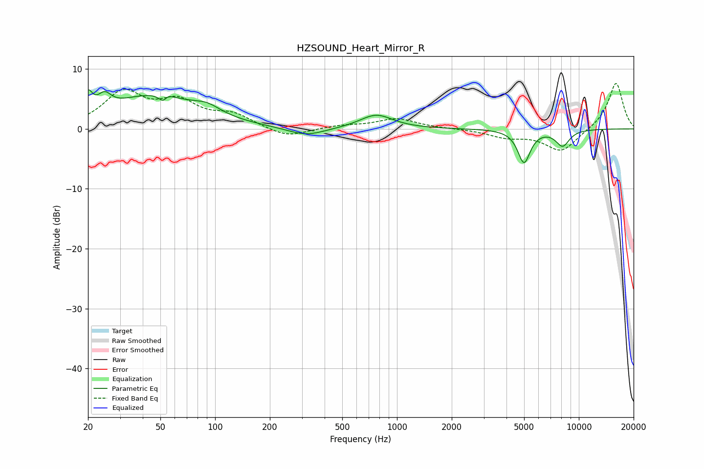

# HZSOUND_Heart_Mirror_R
See [usage instructions](https://github.com/jaakkopasanen/AutoEq#usage) for more options and info.

### Parametric EQs
Apply preamp of -6.6 dB when using parametric equalizer.

|   # | Type    |   Fc (Hz) |    Q |   Gain (dB) |
|-----|---------|-----------|------|-------------|
|   1 | Peaking |        20 | 5.84 |         3.3 |
|   2 | Peaking |        25 | 3.88 |         2.4 |
|   3 | Peaking |        46 | 0.6  |         5.4 |
|   4 | Peaking |        53 | 6    |        -3.4 |
|   5 | Peaking |        53 | 5.87 |         2.8 |
|   6 | Peaking |        90 | 1.92 |         1.4 |
|   7 | Peaking |       316 | 1.37 |        -1.4 |
|   8 | Peaking |       769 | 1.58 |         2.4 |
|   9 | Peaking |      4994 | 4.08 |        -5.5 |
|  10 | Peaking |      8143 | 3.46 |        -2.7 |

### Fixed Band EQs
When using fixed band (also called graphic) equalizer, apply preamp of **-7.7 dB** (if available) and set gains manually with these parameters.

|   # | Type    |   Fc (Hz) |    Q |   Gain (dB) |
|-----|---------|-----------|------|-------------|
|   1 | Peaking |        31 | 1.41 |         5.8 |
|   2 | Peaking |        62 | 1.41 |         4   |
|   3 | Peaking |       125 | 1.41 |         2.1 |
|   4 | Peaking |       250 | 1.41 |        -1.6 |
|   5 | Peaking |       500 | 1.41 |         0.5 |
|   6 | Peaking |      1000 | 1.41 |         1.7 |
|   7 | Peaking |      2000 | 1.41 |         0   |
|   8 | Peaking |      4000 | 1.41 |        -1.3 |
|   9 | Peaking |      8000 | 1.41 |        -3.8 |
|  10 | Peaking |     16000 | 1.41 |         7.8 |

### Graphs

