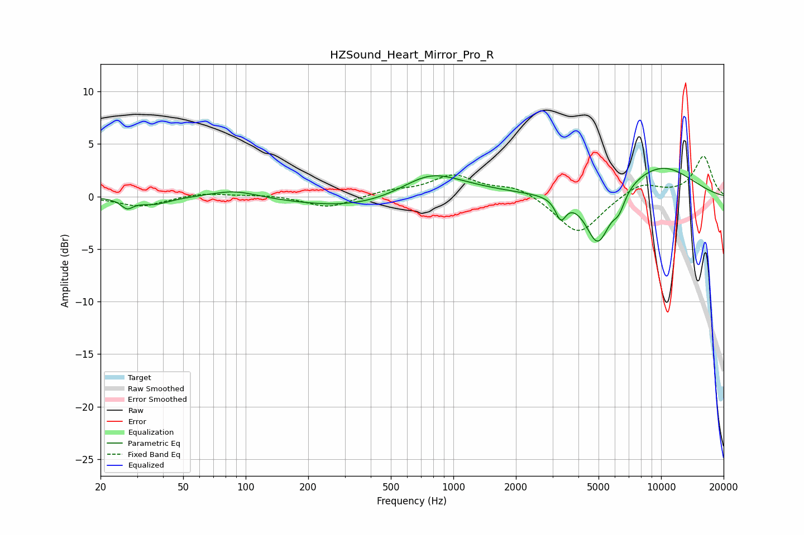

# HZSound_Heart_Mirror_Pro_R
See [usage instructions](https://github.com/jaakkopasanen/AutoEq#usage) for more options and info.

### Parametric EQs
Apply preamp of -2.8 dB when using parametric equalizer.

|   # | Type    |   Fc (Hz) |    Q |   Gain (dB) |
|-----|---------|-----------|------|-------------|
|   1 | Peaking |        27 | 4.88 |        -0.9 |
|   2 | Peaking |        36 | 1.83 |        -0.7 |
|   3 | Peaking |        88 | 1.29 |         0.7 |
|   4 | Peaking |       335 | 0.52 |        -1.1 |
|   5 | Peaking |       770 | 1.01 |         2.1 |
|   6 | Peaking |      1130 | 0.68 |         0.5 |
|   7 | Peaking |      3289 | 5.67 |        -1.9 |
|   8 | Peaking |      4963 | 2.34 |        -5.2 |
|   9 | Peaking |      6268 | 4.59 |        -1.5 |
|  10 | Peaking |      9815 | 0.68 |         3   |

### Fixed Band EQs
When using fixed band (also called graphic) equalizer, apply preamp of **-3.9 dB** (if available) and set gains manually with these parameters.

|   # | Type    |   Fc (Hz) |    Q |   Gain (dB) |
|-----|---------|-----------|------|-------------|
|   1 | Peaking |        31 | 1.41 |        -1   |
|   2 | Peaking |        62 | 1.41 |         0.4 |
|   3 | Peaking |       125 | 1.41 |         0.2 |
|   4 | Peaking |       250 | 1.41 |        -1.1 |
|   5 | Peaking |       500 | 1.41 |         0.5 |
|   6 | Peaking |      1000 | 1.41 |         1.9 |
|   7 | Peaking |      2000 | 1.41 |         1   |
|   8 | Peaking |      4000 | 1.41 |        -3.7 |
|   9 | Peaking |      8000 | 1.41 |         1.3 |
|  10 | Peaking |     16000 | 1.41 |         3.8 |

### Graphs

