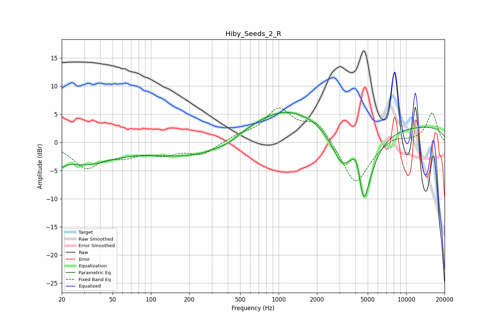

# Hiby_Seeds_2_R
See [usage instructions](https://github.com/jaakkopasanen/AutoEq#usage) for more options and info.

### Parametric EQs
Apply preamp of -5.4 dB when using parametric equalizer.

|   # | Type    |   Fc (Hz) |    Q |   Gain (dB) |
|-----|---------|-----------|------|-------------|
|   1 | Peaking |        20 | 5.43 |        -1.3 |
|   2 | Peaking |        29 | 0.61 |        -3.7 |
|   3 | Peaking |       175 | 0.5  |        -2.1 |
|   4 | Peaking |       281 | 0.83 |        -0.9 |
|   5 | Peaking |       407 | 2.07 |        -0.6 |
|   6 | Peaking |      1113 | 0.49 |         5.5 |
|   7 | Peaking |      3100 | 1.78 |        -4.9 |
|   8 | Peaking |      4128 | 3.1  |         5.9 |
|   9 | Peaking |      4612 | 2.15 |       -15.6 |
|  10 | Peaking |     10000 | 0.18 |         3.1 |

### Fixed Band EQs
When using fixed band (also called graphic) equalizer, apply preamp of **-6.2 dB** (if available) and set gains manually with these parameters.

|   # | Type    |   Fc (Hz) |    Q |   Gain (dB) |
|-----|---------|-----------|------|-------------|
|   1 | Peaking |        31 | 1.41 |        -4.2 |
|   2 | Peaking |        62 | 1.41 |        -1.9 |
|   3 | Peaking |       125 | 1.41 |        -1.7 |
|   4 | Peaking |       250 | 1.41 |        -2.1 |
|   5 | Peaking |       500 | 1.41 |         1   |
|   6 | Peaking |      1000 | 1.41 |         5.6 |
|   7 | Peaking |      2000 | 1.41 |         3.6 |
|   8 | Peaking |      4000 | 1.41 |        -7.8 |
|   9 | Peaking |      8000 | 1.41 |         1.2 |
|  10 | Peaking |     16000 | 1.41 |         5.3 |

### Graphs

