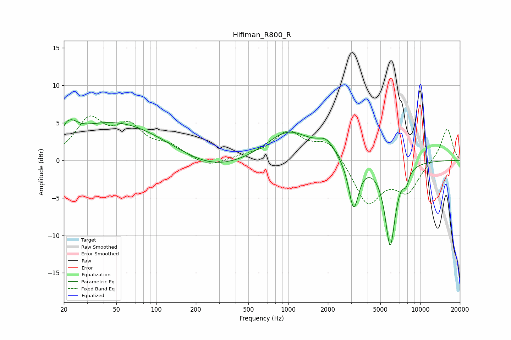

# Hifiman_R800_R
See [usage instructions](https://github.com/jaakkopasanen/AutoEq#usage) for more options and info.

### Parametric EQs
Apply preamp of -5.5 dB when using parametric equalizer.

|   # | Type    |   Fc (Hz) |    Q |   Gain (dB) |
|-----|---------|-----------|------|-------------|
|   1 | Peaking |        21 | 5.98 |        -2.4 |
|   2 | Peaking |        21 | 5.85 |         2.9 |
|   3 | Peaking |        23 | 2.98 |         1.4 |
|   4 | Peaking |        48 | 0.36 |         5.1 |
|   5 | Peaking |       265 | 0.58 |        -1.7 |
|   6 | Peaking |      1004 | 0.84 |         3.9 |
|   7 | Peaking |      1950 | 2.12 |         1.8 |
|   8 | Peaking |      3135 | 3.7  |        -6.6 |
|   9 | Peaking |      5928 | 3.44 |       -11.2 |
|  10 | Peaking |      7823 | 5.92 |        -1.6 |

### Fixed Band EQs
When using fixed band (also called graphic) equalizer, apply preamp of **-6.0 dB** (if available) and set gains manually with these parameters.

|   # | Type    |   Fc (Hz) |    Q |   Gain (dB) |
|-----|---------|-----------|------|-------------|
|   1 | Peaking |        31 | 1.41 |         5.1 |
|   2 | Peaking |        62 | 1.41 |         3.9 |
|   3 | Peaking |       125 | 1.41 |         1.6 |
|   4 | Peaking |       250 | 1.41 |        -1.1 |
|   5 | Peaking |       500 | 1.41 |         0.5 |
|   6 | Peaking |      1000 | 1.41 |         3.6 |
|   7 | Peaking |      2000 | 1.41 |         2.7 |
|   8 | Peaking |      4000 | 1.41 |        -5.8 |
|   9 | Peaking |      8000 | 1.41 |        -3.9 |
|  10 | Peaking |     16000 | 1.41 |         4.4 |

### Graphs

