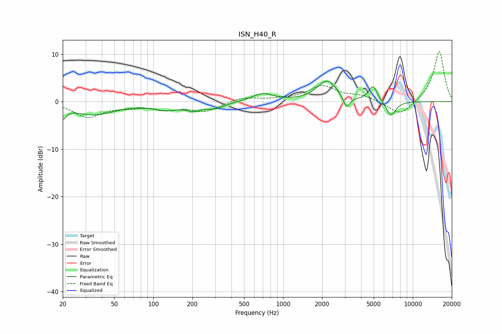

# ISN_H40_R
See [usage instructions](https://github.com/jaakkopasanen/AutoEq#usage) for more options and info.

### Parametric EQs
Apply preamp of -4.4 dB when using parametric equalizer.

|   # | Type    |   Fc (Hz) |    Q |   Gain (dB) |
|-----|---------|-----------|------|-------------|
|   1 | Peaking |        20 | 5.75 |        -2.4 |
|   2 | Peaking |        34 | 0.84 |        -2.7 |
|   3 | Peaking |       124 | 1.52 |        -1.4 |
|   4 | Peaking |       204 | 2.35 |        -1.3 |
|   5 | Peaking |       302 | 1.9  |        -1.2 |
|   6 | Peaking |       696 | 1.73 |         1.6 |
|   7 | Peaking |      2192 | 1.82 |         4.4 |
|   8 | Peaking |      3079 | 5.17 |        -2.7 |
|   9 | Peaking |      4936 | 4.2  |         3.3 |
|  10 | Peaking |      6798 | 3.62 |        -3.2 |

### Fixed Band EQs
When using fixed band (also called graphic) equalizer, apply preamp of **-10.6 dB** (if available) and set gains manually with these parameters.

|   # | Type    |   Fc (Hz) |    Q |   Gain (dB) |
|-----|---------|-----------|------|-------------|
|   1 | Peaking |        31 | 1.41 |        -3.1 |
|   2 | Peaking |        62 | 1.41 |        -0.8 |
|   3 | Peaking |       125 | 1.41 |        -1.3 |
|   4 | Peaking |       250 | 1.41 |        -2   |
|   5 | Peaking |       500 | 1.41 |         0.9 |
|   6 | Peaking |      1000 | 1.41 |         0.4 |
|   7 | Peaking |      2000 | 1.41 |         3.2 |
|   8 | Peaking |      4000 | 1.41 |         1.1 |
|   9 | Peaking |      8000 | 1.41 |        -3.1 |
|  10 | Peaking |     16000 | 1.41 |        10.7 |

### Graphs

