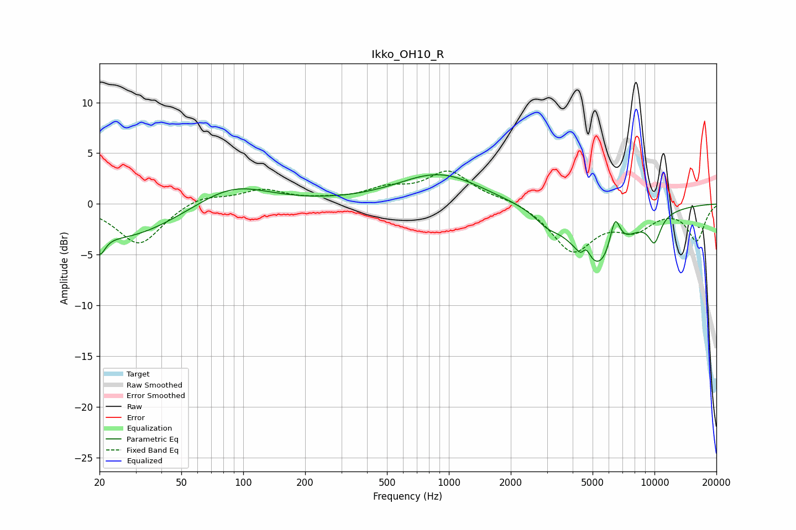

# Ikko_OH10_R
See [usage instructions](https://github.com/jaakkopasanen/AutoEq#usage) for more options and info.

### Parametric EQs
Apply preamp of -3.0 dB when using parametric equalizer.

|   # | Type    |   Fc (Hz) |    Q |   Gain (dB) |
|-----|---------|-----------|------|-------------|
|   1 | Peaking |        20 | 5.38 |        -2   |
|   2 | Peaking |        26 | 0.55 |        -3.4 |
|   3 | Peaking |        88 | 0.8  |         2.2 |
|   4 | Peaking |       901 | 0.7  |         3   |
|   5 | Peaking |      3000 | 2.55 |        -0.9 |
|   6 | Peaking |      4468 | 6    |        -1.4 |
|   7 | Peaking |      4597 | 5.96 |         2.1 |
|   8 | Peaking |      5358 | 1.12 |        -6.5 |
|   9 | Peaking |      6421 | 5.1  |         3.5 |
|  10 | Peaking |     10000 | 4    |        -2.5 |

### Fixed Band EQs
When using fixed band (also called graphic) equalizer, apply preamp of **-3.3 dB** (if available) and set gains manually with these parameters.

|   # | Type    |   Fc (Hz) |    Q |   Gain (dB) |
|-----|---------|-----------|------|-------------|
|   1 | Peaking |        31 | 1.41 |        -4   |
|   2 | Peaking |        62 | 1.41 |         0.9 |
|   3 | Peaking |       125 | 1.41 |         1.3 |
|   4 | Peaking |       250 | 1.41 |         0.2 |
|   5 | Peaking |       500 | 1.41 |         1.3 |
|   6 | Peaking |      1000 | 1.41 |         3.1 |
|   7 | Peaking |      2000 | 1.41 |         0.5 |
|   8 | Peaking |      4000 | 1.41 |        -4.6 |
|   9 | Peaking |      8000 | 1.41 |        -2.1 |
|  10 | Peaking |     16000 | 1.41 |        -3.5 |

### Graphs

