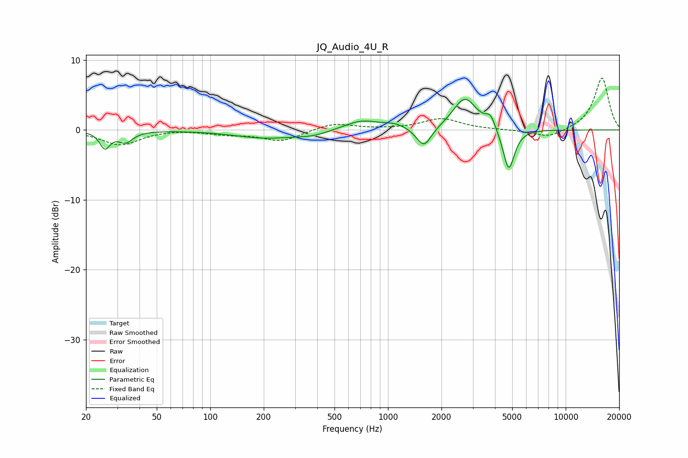

# JQ_Audio_4U_R
See [usage instructions](https://github.com/jaakkopasanen/AutoEq#usage) for more options and info.

### Parametric EQs
Apply preamp of -4.5 dB when using parametric equalizer.

|   # | Type    |   Fc (Hz) |    Q |   Gain (dB) |
|-----|---------|-----------|------|-------------|
|   1 | Peaking |        26 | 5.03 |        -2.4 |
|   2 | Peaking |        33 | 3.48 |        -1.6 |
|   3 | Peaking |       207 | 0.8  |        -1.1 |
|   4 | Peaking |       375 | 1.69 |        -0.5 |
|   5 | Peaking |       708 | 1.46 |         1.4 |
|   6 | Peaking |      1100 | 2.07 |         0.7 |
|   7 | Peaking |      1593 | 3.3  |        -3   |
|   8 | Peaking |      2710 | 2.12 |         4.6 |
|   9 | Peaking |      3773 | 4.96 |         1.7 |
|  10 | Peaking |      4779 | 4.28 |        -6.2 |

### Fixed Band EQs
When using fixed band (also called graphic) equalizer, apply preamp of **-7.5 dB** (if available) and set gains manually with these parameters.

|   # | Type    |   Fc (Hz) |    Q |   Gain (dB) |
|-----|---------|-----------|------|-------------|
|   1 | Peaking |        31 | 1.41 |        -2.1 |
|   2 | Peaking |        62 | 1.41 |         0.2 |
|   3 | Peaking |       125 | 1.41 |        -0.5 |
|   4 | Peaking |       250 | 1.41 |        -1.6 |
|   5 | Peaking |       500 | 1.41 |         1   |
|   6 | Peaking |      1000 | 1.41 |         0.1 |
|   7 | Peaking |      2000 | 1.41 |         1.6 |
|   8 | Peaking |      4000 | 1.41 |         0   |
|   9 | Peaking |      8000 | 1.41 |        -1.2 |
|  10 | Peaking |     16000 | 1.41 |         7.5 |

### Graphs

