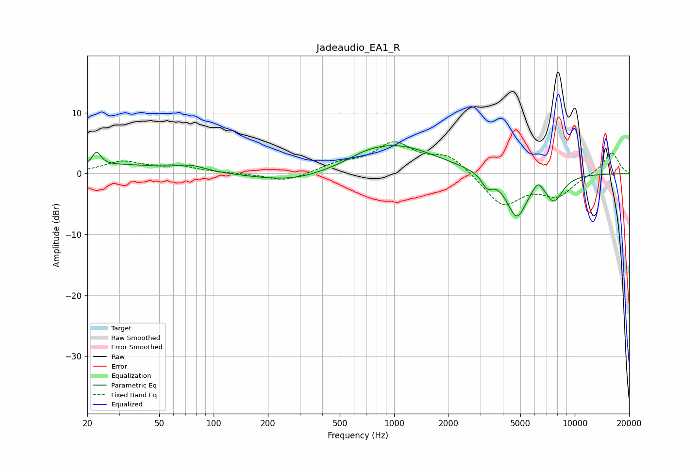

# Jadeaudio_EA1_R
See [usage instructions](https://github.com/jaakkopasanen/AutoEq#usage) for more options and info.

### Parametric EQs
Apply preamp of -4.7 dB when using parametric equalizer.

|   # | Type    |   Fc (Hz) |    Q |   Gain (dB) |
|-----|---------|-----------|------|-------------|
|   1 | Peaking |        22 | 5.9  |         2.3 |
|   2 | Peaking |        31 | 0.61 |         1.4 |
|   3 | Peaking |        75 | 1.73 |         1   |
|   4 | Peaking |       279 | 0.67 |        -1.5 |
|   5 | Peaking |       698 | 1.39 |         0.7 |
|   6 | Peaking |      1034 | 0.63 |         4.6 |
|   7 | Peaking |      3270 | 4.8  |        -2   |
|   8 | Peaking |      4771 | 2.43 |        -7.1 |
|   9 | Peaking |      6259 | 5    |         1.6 |
|  10 | Peaking |      7684 | 2.74 |        -4   |

### Fixed Band EQs
When using fixed band (also called graphic) equalizer, apply preamp of **-5.3 dB** (if available) and set gains manually with these parameters.

|   # | Type    |   Fc (Hz) |    Q |   Gain (dB) |
|-----|---------|-----------|------|-------------|
|   1 | Peaking |        31 | 1.41 |         1.9 |
|   2 | Peaking |        62 | 1.41 |         1.1 |
|   3 | Peaking |       125 | 1.41 |         0   |
|   4 | Peaking |       250 | 1.41 |        -1.4 |
|   5 | Peaking |       500 | 1.41 |         1.4 |
|   6 | Peaking |      1000 | 1.41 |         4.7 |
|   7 | Peaking |      2000 | 1.41 |         2.9 |
|   8 | Peaking |      4000 | 1.41 |        -5.3 |
|   9 | Peaking |      8000 | 1.41 |        -3.4 |
|  10 | Peaking |     16000 | 1.41 |         3.6 |

### Graphs

