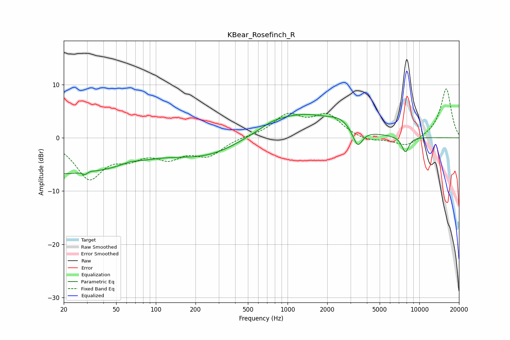

# KBear_Rosefinch_R
See [usage instructions](https://github.com/jaakkopasanen/AutoEq#usage) for more options and info.

### Parametric EQs
Apply preamp of -4.5 dB when using parametric equalizer.

|   # | Type    |   Fc (Hz) |    Q |   Gain (dB) |
|-----|---------|-----------|------|-------------|
|   1 | Peaking |        20 | 0.25 |        -6.7 |
|   2 | Peaking |        29 | 5.46 |        -3.9 |
|   3 | Peaking |        29 | 4.83 |         3.6 |
|   4 | Peaking |        63 | 2.37 |         0.4 |
|   5 | Peaking |       250 | 0.55 |        -3.1 |
|   6 | Peaking |       760 | 1.66 |         0.6 |
|   7 | Peaking |      1267 | 0.51 |         4.6 |
|   8 | Peaking |      2496 | 1.86 |         1.2 |
|   9 | Peaking |      3404 | 3.83 |        -3.5 |
|  10 | Peaking |      7838 | 4.81 |        -2.9 |

### Fixed Band EQs
When using fixed band (also called graphic) equalizer, apply preamp of **-9.3 dB** (if available) and set gains manually with these parameters.

|   # | Type    |   Fc (Hz) |    Q |   Gain (dB) |
|-----|---------|-----------|------|-------------|
|   1 | Peaking |        31 | 1.41 |        -7.2 |
|   2 | Peaking |        62 | 1.41 |        -2.8 |
|   3 | Peaking |       125 | 1.41 |        -3.1 |
|   4 | Peaking |       250 | 1.41 |        -3.1 |
|   5 | Peaking |       500 | 1.41 |         0.2 |
|   6 | Peaking |      1000 | 1.41 |         4   |
|   7 | Peaking |      2000 | 1.41 |         4   |
|   8 | Peaking |      4000 | 1.41 |        -0.8 |
|   9 | Peaking |      8000 | 1.41 |        -1.8 |
|  10 | Peaking |     16000 | 1.41 |         9.3 |

### Graphs

