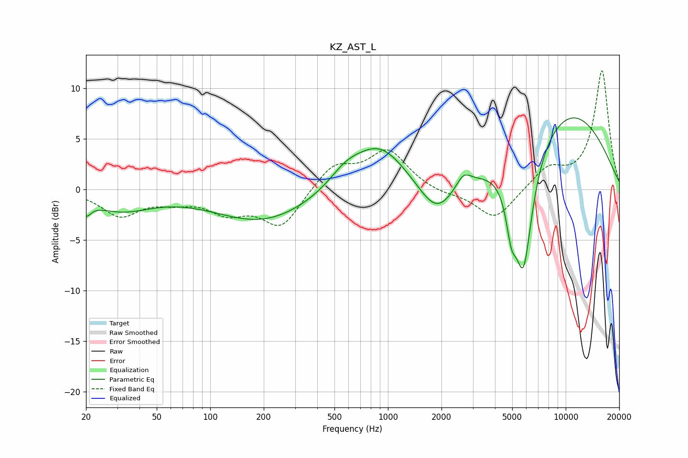

# KZ_AST_L
See [usage instructions](https://github.com/jaakkopasanen/AutoEq#usage) for more options and info.

### Parametric EQs
Apply preamp of -7.1 dB when using parametric equalizer.

|   # | Type    |   Fc (Hz) |    Q |   Gain (dB) |
|-----|---------|-----------|------|-------------|
|   1 | Peaking |        20 | 5.12 |        -1.3 |
|   2 | Peaking |        31 | 0.82 |        -1.9 |
|   3 | Peaking |       198 | 0.52 |        -3.2 |
|   4 | Peaking |       580 | 1.49 |         1.5 |
|   5 | Peaking |       898 | 0.95 |         4.4 |
|   6 | Peaking |      1881 | 1.37 |        -3.6 |
|   7 | Peaking |      2657 | 3.35 |         1.4 |
|   8 | Peaking |      4945 | 4.81 |        -3.7 |
|   9 | Peaking |      5784 | 2.52 |       -12.3 |
|  10 | Peaking |     10000 | 0.41 |         7.9 |

### Fixed Band EQs
When using fixed band (also called graphic) equalizer, apply preamp of **-11.8 dB** (if available) and set gains manually with these parameters.

|   # | Type    |   Fc (Hz) |    Q |   Gain (dB) |
|-----|---------|-----------|------|-------------|
|   1 | Peaking |        31 | 1.41 |        -2.5 |
|   2 | Peaking |        62 | 1.41 |        -0.9 |
|   3 | Peaking |       125 | 1.41 |        -2   |
|   4 | Peaking |       250 | 1.41 |        -3.7 |
|   5 | Peaking |       500 | 1.41 |         2.4 |
|   6 | Peaking |      1000 | 1.41 |         3.7 |
|   7 | Peaking |      2000 | 1.41 |        -0.5 |
|   8 | Peaking |      4000 | 1.41 |        -3.1 |
|   9 | Peaking |      8000 | 1.41 |         2   |
|  10 | Peaking |     16000 | 1.41 |        11.7 |

### Graphs

