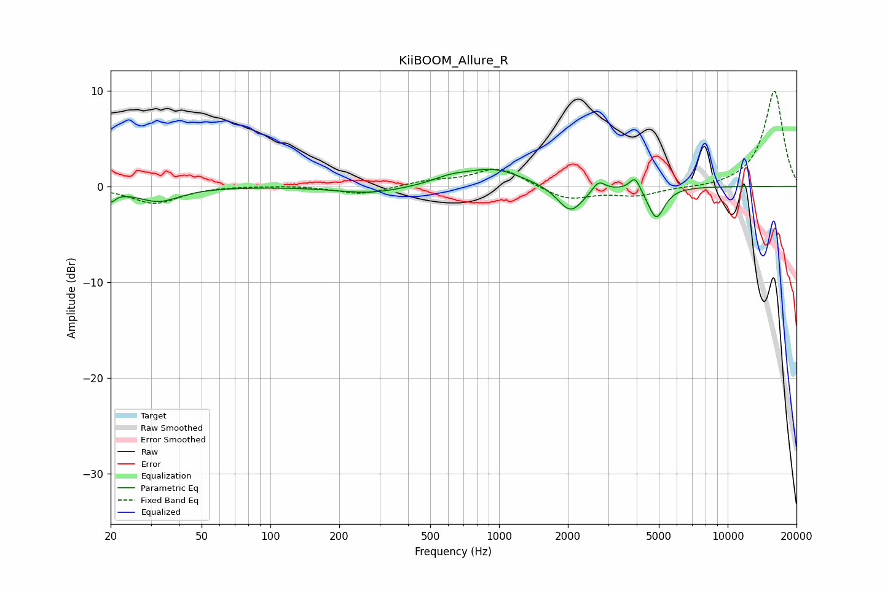

# KiiBOOM_Allure_R
See [usage instructions](https://github.com/jaakkopasanen/AutoEq#usage) for more options and info.

### Parametric EQs
Apply preamp of -1.9 dB when using parametric equalizer.

|   # | Type    |   Fc (Hz) |    Q |   Gain (dB) |
|-----|---------|-----------|------|-------------|
|   1 | Peaking |        20 | 4.79 |        -1.7 |
|   2 | Peaking |        21 | 5.43 |         0.7 |
|   3 | Peaking |        32 | 1.51 |        -1.5 |
|   4 | Peaking |       273 | 0.97 |        -0.8 |
|   5 | Peaking |       610 | 1.89 |         0.6 |
|   6 | Peaking |       943 | 1.1  |         1.8 |
|   7 | Peaking |      2055 | 2.5  |        -2.8 |
|   8 | Peaking |      2725 | 5.25 |         1.1 |
|   9 | Peaking |      3935 | 6    |         1.5 |
|  10 | Peaking |      4867 | 3.92 |        -3.3 |

### Fixed Band EQs
When using fixed band (also called graphic) equalizer, apply preamp of **-10.0 dB** (if available) and set gains manually with these parameters.

|   # | Type    |   Fc (Hz) |    Q |   Gain (dB) |
|-----|---------|-----------|------|-------------|
|   1 | Peaking |        31 | 1.41 |        -1.8 |
|   2 | Peaking |        62 | 1.41 |         0.1 |
|   3 | Peaking |       125 | 1.41 |         0.1 |
|   4 | Peaking |       250 | 1.41 |        -0.9 |
|   5 | Peaking |       500 | 1.41 |         0.5 |
|   6 | Peaking |      1000 | 1.41 |         2   |
|   7 | Peaking |      2000 | 1.41 |        -1.4 |
|   8 | Peaking |      4000 | 1.41 |        -0.9 |
|   9 | Peaking |      8000 | 1.41 |        -0.2 |
|  10 | Peaking |     16000 | 1.41 |        10   |

### Graphs

