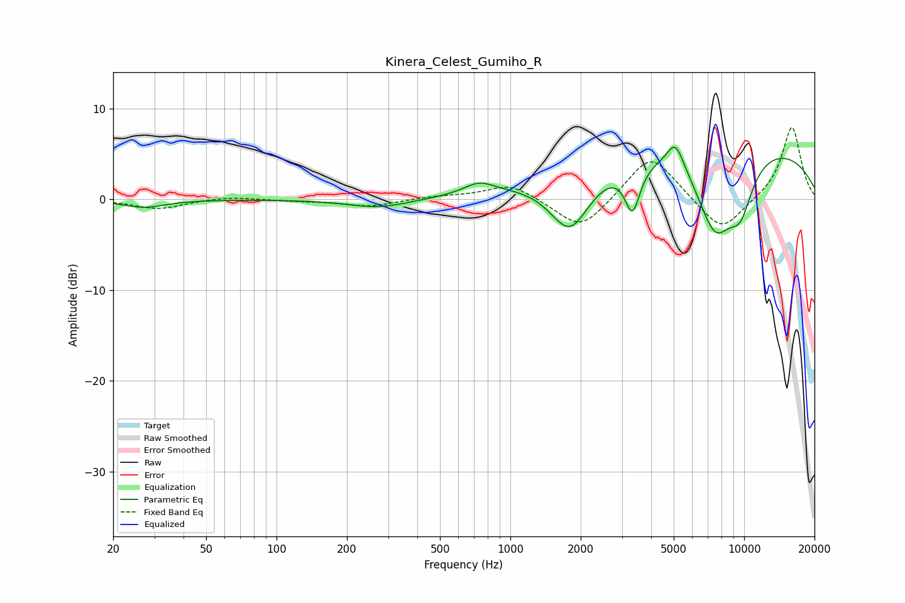

# Kinera_Celest_Gumiho_R
See [usage instructions](https://github.com/jaakkopasanen/AutoEq#usage) for more options and info.

### Parametric EQs
Apply preamp of -5.8 dB when using parametric equalizer.

|   # | Type    |   Fc (Hz) |    Q |   Gain (dB) |
|-----|---------|-----------|------|-------------|
|   1 | Peaking |        27 | 1.52 |        -0.9 |
|   2 | Peaking |       275 | 1.05 |        -1   |
|   3 | Peaking |       736 | 2.19 |         1.2 |
|   4 | Peaking |      1801 | 1.57 |        -6.7 |
|   5 | Peaking |      3329 | 4.33 |        -5.1 |
|   6 | Peaking |      5082 | 3.73 |         3.1 |
|   7 | Peaking |      5763 | 5.38 |         0.1 |
|   8 | Peaking |      7486 | 0.18 |         6.7 |
|   9 | Peaking |      7520 | 1.57 |        -8.8 |
|  10 | Peaking |      9646 | 2.29 |        -4.7 |

### Fixed Band EQs
When using fixed band (also called graphic) equalizer, apply preamp of **-8.0 dB** (if available) and set gains manually with these parameters.

|   # | Type    |   Fc (Hz) |    Q |   Gain (dB) |
|-----|---------|-----------|------|-------------|
|   1 | Peaking |        31 | 1.41 |        -1.1 |
|   2 | Peaking |        62 | 1.41 |         0.3 |
|   3 | Peaking |       125 | 1.41 |        -0.2 |
|   4 | Peaking |       250 | 1.41 |        -0.8 |
|   5 | Peaking |       500 | 1.41 |         0.3 |
|   6 | Peaking |      1000 | 1.41 |         1.7 |
|   7 | Peaking |      2000 | 1.41 |        -3.6 |
|   8 | Peaking |      4000 | 1.41 |         5.2 |
|   9 | Peaking |      8000 | 1.41 |        -3.8 |
|  10 | Peaking |     16000 | 1.41 |         8.1 |

### Graphs

