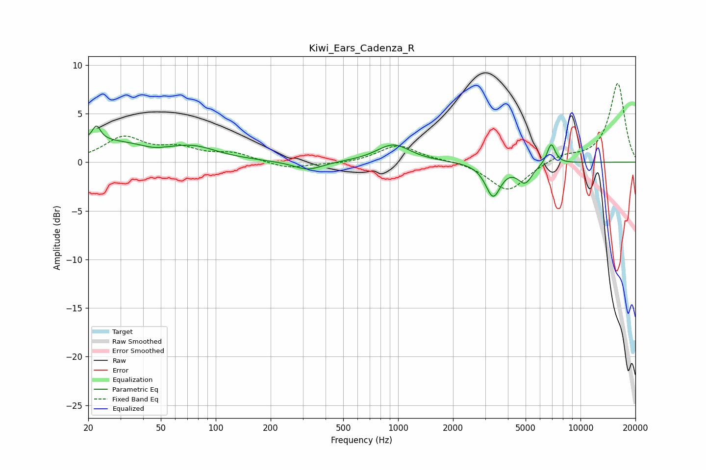

# Kiwi_Ears_Cadenza_R
See [usage instructions](https://github.com/jaakkopasanen/AutoEq#usage) for more options and info.

### Parametric EQs
Apply preamp of -3.8 dB when using parametric equalizer.

|   # | Type    |   Fc (Hz) |    Q |   Gain (dB) |
|-----|---------|-----------|------|-------------|
|   1 | Peaking |        22 | 5.92 |         3.2 |
|   2 | Peaking |        23 | 0.4  |         2.2 |
|   3 | Peaking |        23 | 6    |        -1.8 |
|   4 | Peaking |        46 | 1.95 |        -0.4 |
|   5 | Peaking |        77 | 1.17 |         0.9 |
|   6 | Peaking |       320 | 1.78 |        -0.9 |
|   7 | Peaking |       941 | 1.54 |         1.8 |
|   8 | Peaking |      3317 | 3.42 |        -3.4 |
|   9 | Peaking |      4970 | 3.38 |        -1.9 |
|  10 | Peaking |      6908 | 5.97 |         2.1 |

### Fixed Band EQs
When using fixed band (also called graphic) equalizer, apply preamp of **-8.2 dB** (if available) and set gains manually with these parameters.

|   # | Type    |   Fc (Hz) |    Q |   Gain (dB) |
|-----|---------|-----------|------|-------------|
|   1 | Peaking |        31 | 1.41 |         2.4 |
|   2 | Peaking |        62 | 1.41 |         1.2 |
|   3 | Peaking |       125 | 1.41 |         0.8 |
|   4 | Peaking |       250 | 1.41 |        -0.7 |
|   5 | Peaking |       500 | 1.41 |        -0.2 |
|   6 | Peaking |      1000 | 1.41 |         1.8 |
|   7 | Peaking |      2000 | 1.41 |         0.1 |
|   8 | Peaking |      4000 | 1.41 |        -3   |
|   9 | Peaking |      8000 | 1.41 |         0.7 |
|  10 | Peaking |     16000 | 1.41 |         8.1 |

### Graphs

