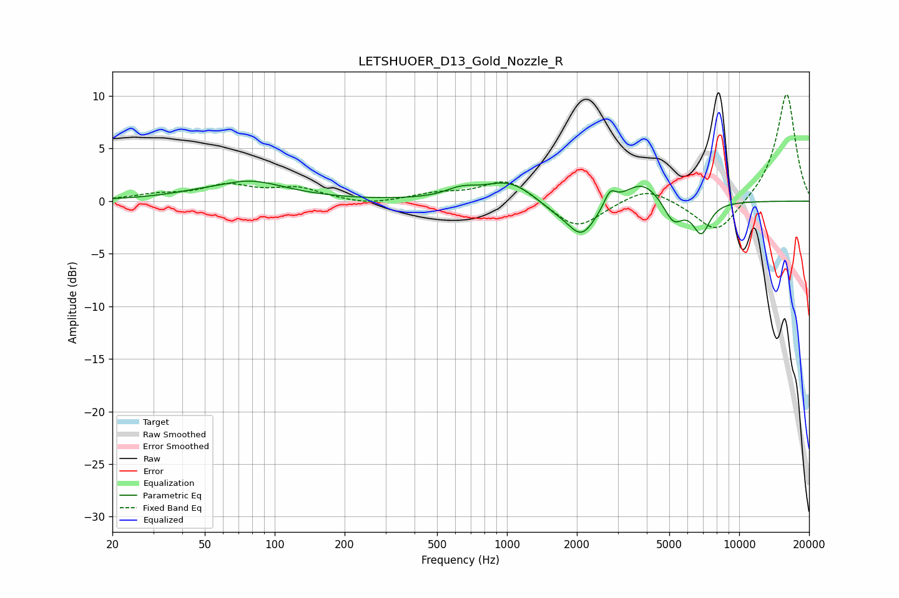

# LETSHUOER_D13_Gold_Nozzle_R
See [usage instructions](https://github.com/jaakkopasanen/AutoEq#usage) for more options and info.

### Parametric EQs
Apply preamp of -2.0 dB when using parametric equalizer.

|   # | Type    |   Fc (Hz) |    Q |   Gain (dB) |
|-----|---------|-----------|------|-------------|
|   1 | Peaking |        61 | 1.67 |        -0.4 |
|   2 | Peaking |        72 | 0.82 |         2.2 |
|   3 | Peaking |       636 | 2.1  |         0.8 |
|   4 | Peaking |      1021 | 1.29 |         1.9 |
|   5 | Peaking |      1578 | 1.92 |        -0.7 |
|   6 | Peaking |      2097 | 2.21 |        -3.4 |
|   7 | Peaking |      2779 | 5.72 |         1.4 |
|   8 | Peaking |      3826 | 1.81 |         2.1 |
|   9 | Peaking |      5210 | 3.35 |        -2.2 |
|  10 | Peaking |      6869 | 3.73 |        -3   |

### Fixed Band EQs
When using fixed band (also called graphic) equalizer, apply preamp of **-10.2 dB** (if available) and set gains manually with these parameters.

|   # | Type    |   Fc (Hz) |    Q |   Gain (dB) |
|-----|---------|-----------|------|-------------|
|   1 | Peaking |        31 | 1.41 |         0.5 |
|   2 | Peaking |        62 | 1.41 |         1.4 |
|   3 | Peaking |       125 | 1.41 |         1.1 |
|   4 | Peaking |       250 | 1.41 |        -0.4 |
|   5 | Peaking |       500 | 1.41 |         0.6 |
|   6 | Peaking |      1000 | 1.41 |         2.1 |
|   7 | Peaking |      2000 | 1.41 |        -2.8 |
|   8 | Peaking |      4000 | 1.41 |         1.5 |
|   9 | Peaking |      8000 | 1.41 |        -3.3 |
|  10 | Peaking |     16000 | 1.41 |        10.4 |

### Graphs

