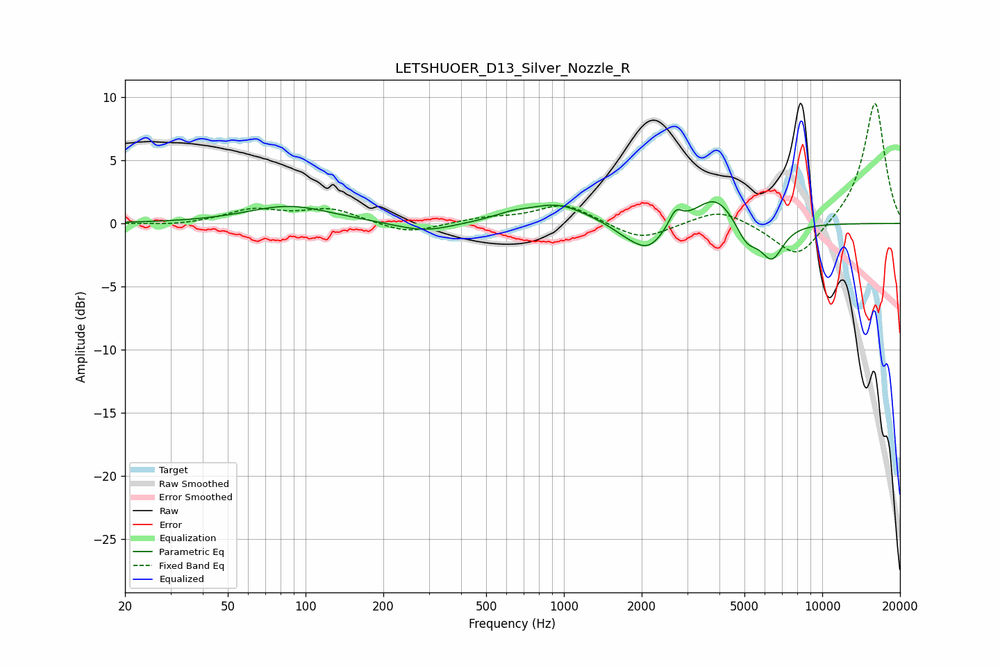

# LETSHUOER_D13_Silver_Nozzle_R
See [usage instructions](https://github.com/jaakkopasanen/AutoEq#usage) for more options and info.

### Parametric EQs
Apply preamp of -1.8 dB when using parametric equalizer.

|   # | Type    |   Fc (Hz) |    Q |   Gain (dB) |
|-----|---------|-----------|------|-------------|
|   1 | Peaking |        86 | 0.87 |         1.4 |
|   2 | Peaking |       287 | 1.3  |        -0.8 |
|   3 | Peaking |       627 | 1.88 |         0.5 |
|   4 | Peaking |       947 | 1.24 |         1.5 |
|   5 | Peaking |      1747 | 2.08 |        -0.7 |
|   6 | Peaking |      2128 | 2.21 |        -2   |
|   7 | Peaking |      2705 | 5.63 |         1.2 |
|   8 | Peaking |      3870 | 1.79 |         2.4 |
|   9 | Peaking |      5106 | 3.16 |        -1.8 |
|  10 | Peaking |      6388 | 3.06 |        -2.7 |

### Fixed Band EQs
When using fixed band (also called graphic) equalizer, apply preamp of **-9.6 dB** (if available) and set gains manually with these parameters.

|   # | Type    |   Fc (Hz) |    Q |   Gain (dB) |
|-----|---------|-----------|------|-------------|
|   1 | Peaking |        31 | 1.41 |        -0.2 |
|   2 | Peaking |        62 | 1.41 |         1   |
|   3 | Peaking |       125 | 1.41 |         1.1 |
|   4 | Peaking |       250 | 1.41 |        -0.9 |
|   5 | Peaking |       500 | 1.41 |         0.4 |
|   6 | Peaking |      1000 | 1.41 |         1.6 |
|   7 | Peaking |      2000 | 1.41 |        -1.4 |
|   8 | Peaking |      4000 | 1.41 |         1.2 |
|   9 | Peaking |      8000 | 1.41 |        -3   |
|  10 | Peaking |     16000 | 1.41 |         9.7 |

### Graphs

