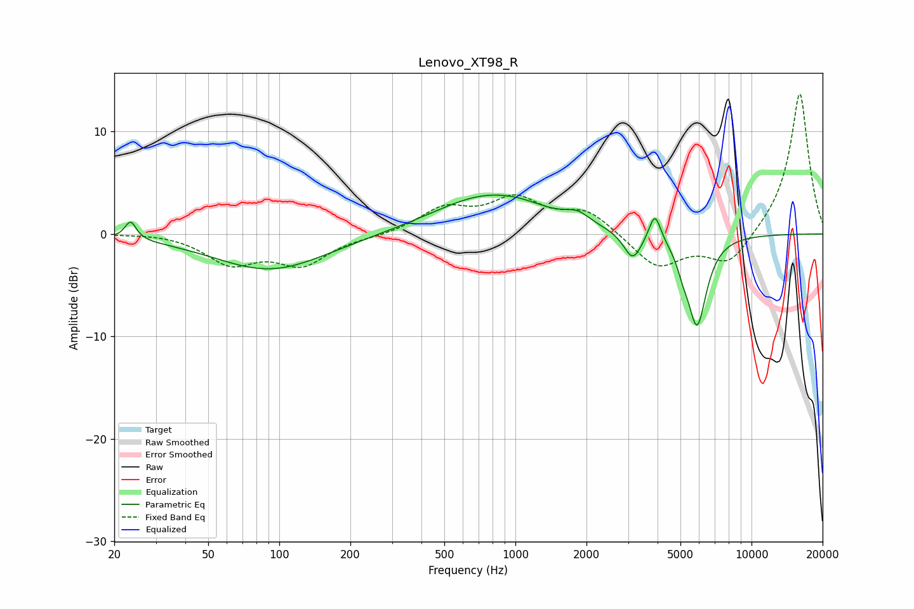

# Lenovo_XT98_R
See [usage instructions](https://github.com/jaakkopasanen/AutoEq#usage) for more options and info.

### Parametric EQs
Apply preamp of -3.9 dB when using parametric equalizer.

|   # | Type    |   Fc (Hz) |    Q |   Gain (dB) |
|-----|---------|-----------|------|-------------|
|   1 | Peaking |        23 | 5.97 |         1.8 |
|   2 | Peaking |        92 | 0.59 |        -3.5 |
|   3 | Peaking |       768 | 0.62 |         3.8 |
|   4 | Peaking |      1060 | 1.63 |         0.3 |
|   5 | Peaking |      1831 | 2.76 |         0.9 |
|   6 | Peaking |      3138 | 4.11 |        -2.1 |
|   7 | Peaking |      3142 | 2.48 |        -0.7 |
|   8 | Peaking |      3897 | 5.59 |         2.9 |
|   9 | Peaking |      5124 | 5.99 |        -1.2 |
|  10 | Peaking |      5878 | 3.39 |        -8.8 |

### Fixed Band EQs
When using fixed band (also called graphic) equalizer, apply preamp of **-13.7 dB** (if available) and set gains manually with these parameters.

|   # | Type    |   Fc (Hz) |    Q |   Gain (dB) |
|-----|---------|-----------|------|-------------|
|   1 | Peaking |        31 | 1.41 |         0.2 |
|   2 | Peaking |        62 | 1.41 |        -2.7 |
|   3 | Peaking |       125 | 1.41 |        -2.8 |
|   4 | Peaking |       250 | 1.41 |        -0.2 |
|   5 | Peaking |       500 | 1.41 |         2.3 |
|   6 | Peaking |      1000 | 1.41 |         3.1 |
|   7 | Peaking |      2000 | 1.41 |         2.2 |
|   8 | Peaking |      4000 | 1.41 |        -3.3 |
|   9 | Peaking |      8000 | 1.41 |        -3.1 |
|  10 | Peaking |     16000 | 1.41 |        13.9 |

### Graphs

