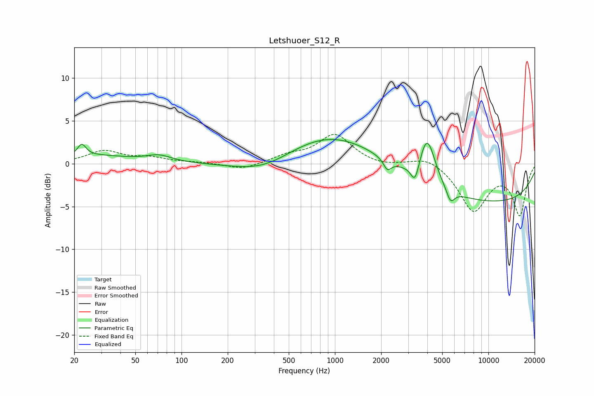

# Letshuoer_S12_R
See [usage instructions](https://github.com/jaakkopasanen/AutoEq#usage) for more options and info.

### Parametric EQs
Apply preamp of -2.9 dB when using parametric equalizer.

|   # | Type    |   Fc (Hz) |    Q |   Gain (dB) |
|-----|---------|-----------|------|-------------|
|   1 | Peaking |        22 | 5.19 |         1.4 |
|   2 | Peaking |        27 | 0.59 |         0.9 |
|   3 | Peaking |        71 | 1.74 |         0.7 |
|   4 | Peaking |       354 | 0.69 |        -2   |
|   5 | Peaking |       913 | 0.42 |         3.9 |
|   6 | Peaking |      2197 | 5.62 |        -1.2 |
|   7 | Peaking |      3327 | 5.34 |        -2.3 |
|   8 | Peaking |      3990 | 2.73 |         5.4 |
|   9 | Peaking |      5661 | 5.05 |        -1.6 |
|  10 | Peaking |      9739 | 0.23 |        -4.5 |

### Fixed Band EQs
When using fixed band (also called graphic) equalizer, apply preamp of **-3.5 dB** (if available) and set gains manually with these parameters.

|   # | Type    |   Fc (Hz) |    Q |   Gain (dB) |
|-----|---------|-----------|------|-------------|
|   1 | Peaking |        31 | 1.41 |         1.4 |
|   2 | Peaking |        62 | 1.41 |         0.6 |
|   3 | Peaking |       125 | 1.41 |         0.1 |
|   4 | Peaking |       250 | 1.41 |        -0.7 |
|   5 | Peaking |       500 | 1.41 |         0.8 |
|   6 | Peaking |      1000 | 1.41 |         3.3 |
|   7 | Peaking |      2000 | 1.41 |        -0.4 |
|   8 | Peaking |      4000 | 1.41 |         1   |
|   9 | Peaking |      8000 | 1.41 |        -5.4 |
|  10 | Peaking |     16000 | 1.41 |        -5.8 |

### Graphs

