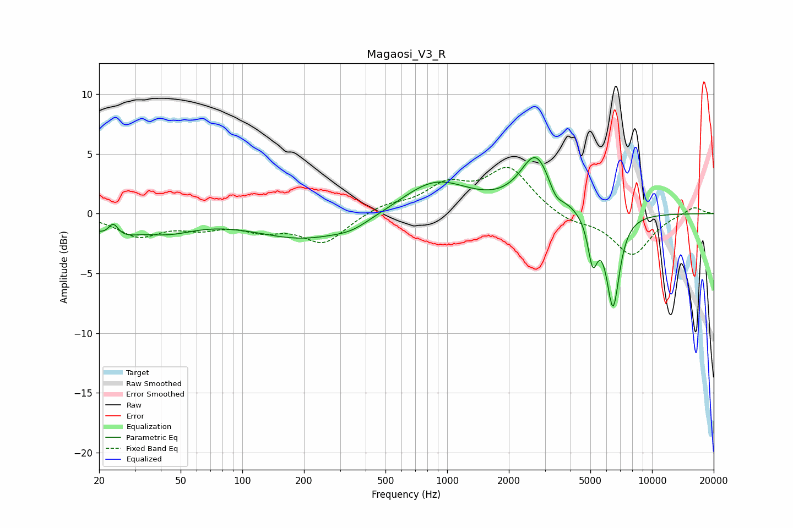

# Magaosi_V3_R
See [usage instructions](https://github.com/jaakkopasanen/AutoEq#usage) for more options and info.

### Parametric EQs
Apply preamp of -4.8 dB when using parametric equalizer.

|   # | Type    |   Fc (Hz) |    Q |   Gain (dB) |
|-----|---------|-----------|------|-------------|
|   1 | Peaking |        23 | 1.3  |        -1.6 |
|   2 | Peaking |        23 | 5.79 |         1.2 |
|   3 | Peaking |        44 | 1.05 |        -1.1 |
|   4 | Peaking |       203 | 0.58 |        -2.1 |
|   5 | Peaking |       343 | 1.68 |        -0.5 |
|   6 | Peaking |       875 | 0.85 |         2.8 |
|   7 | Peaking |      2717 | 1.86 |         4.7 |
|   8 | Peaking |      3385 | 4.2  |        -1.1 |
|   9 | Peaking |      5132 | 5.85 |        -3.7 |
|  10 | Peaking |      6452 | 4.21 |        -7.7 |

### Fixed Band EQs
When using fixed band (also called graphic) equalizer, apply preamp of **-4.0 dB** (if available) and set gains manually with these parameters.

|   # | Type    |   Fc (Hz) |    Q |   Gain (dB) |
|-----|---------|-----------|------|-------------|
|   1 | Peaking |        31 | 1.41 |        -1.8 |
|   2 | Peaking |        62 | 1.41 |        -1   |
|   3 | Peaking |       125 | 1.41 |        -1.1 |
|   4 | Peaking |       250 | 1.41 |        -2.4 |
|   5 | Peaking |       500 | 1.41 |         0.7 |
|   6 | Peaking |      1000 | 1.41 |         2.2 |
|   7 | Peaking |      2000 | 1.41 |         3.7 |
|   8 | Peaking |      4000 | 1.41 |        -0.7 |
|   9 | Peaking |      8000 | 1.41 |        -3.5 |
|  10 | Peaking |     16000 | 1.41 |         0.6 |

### Graphs

