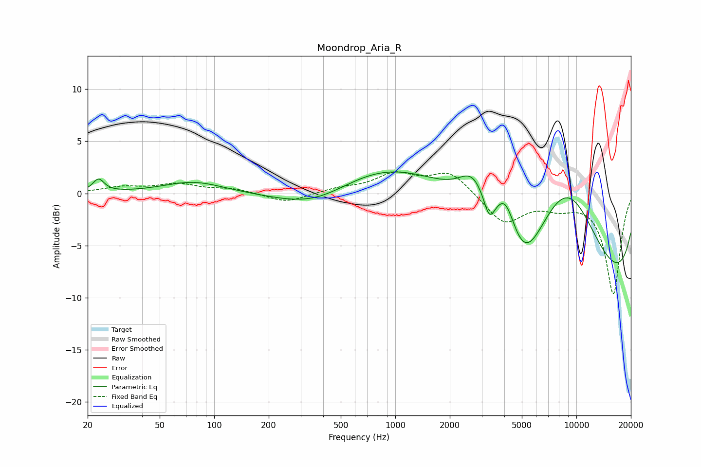

# Moondrop_Aria_R
See [usage instructions](https://github.com/jaakkopasanen/AutoEq#usage) for more options and info.

### Parametric EQs
Apply preamp of -2.2 dB when using parametric equalizer.

|   # | Type    |   Fc (Hz) |    Q |   Gain (dB) |
|-----|---------|-----------|------|-------------|
|   1 | Peaking |        23 | 4.64 |         1.2 |
|   2 | Peaking |        77 | 0.85 |         1.1 |
|   3 | Peaking |       374 | 0.61 |        -3.1 |
|   4 | Peaking |      1950 | 0.18 |         5.8 |
|   5 | Peaking |      2678 | 1.83 |         2.9 |
|   6 | Peaking |      3307 | 4.74 |        -2.2 |
|   7 | Peaking |      4073 | 2.62 |         3.2 |
|   8 | Peaking |      5158 | 1.24 |        -5.7 |
|   9 | Peaking |      8865 | 0.6  |        10.1 |
|  10 | Peaking |      9613 | 0.18 |       -12.4 |

### Fixed Band EQs
When using fixed band (also called graphic) equalizer, apply preamp of **-2.2 dB** (if available) and set gains manually with these parameters.

|   # | Type    |   Fc (Hz) |    Q |   Gain (dB) |
|-----|---------|-----------|------|-------------|
|   1 | Peaking |        31 | 1.41 |         0.6 |
|   2 | Peaking |        62 | 1.41 |         0.8 |
|   3 | Peaking |       125 | 1.41 |         0.4 |
|   4 | Peaking |       250 | 1.41 |        -0.9 |
|   5 | Peaking |       500 | 1.41 |         0.4 |
|   6 | Peaking |      1000 | 1.41 |         1.7 |
|   7 | Peaking |      2000 | 1.41 |         2.1 |
|   8 | Peaking |      4000 | 1.41 |        -2.9 |
|   9 | Peaking |      8000 | 1.41 |        -1   |
|  10 | Peaking |     16000 | 1.41 |        -9.6 |

### Graphs

