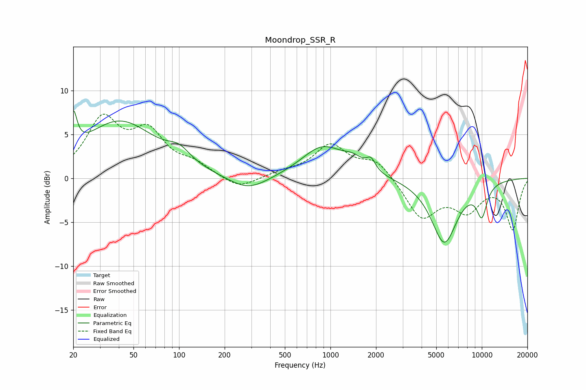

# Moondrop_SSR_R
See [usage instructions](https://github.com/jaakkopasanen/AutoEq#usage) for more options and info.

### Parametric EQs
Apply preamp of -7.8 dB when using parametric equalizer.

|   # | Type    |   Fc (Hz) |    Q |   Gain (dB) |
|-----|---------|-----------|------|-------------|
|   1 | Peaking |        20 | 6    |         4.1 |
|   2 | Peaking |        40 | 0.59 |         6.4 |
|   3 | Peaking |       100 | 1.92 |         1.4 |
|   4 | Peaking |       286 | 1.09 |        -1.7 |
|   5 | Peaking |       887 | 1.02 |         3.5 |
|   6 | Peaking |      1420 | 2.05 |         1.2 |
|   7 | Peaking |      1852 | 4.9  |         1.3 |
|   8 | Peaking |      5646 | 1.6  |        -7.3 |
|   9 | Peaking |     10000 | 3.58 |        -2.9 |
|  10 | Peaking |     10000 | 3.2  |        -0.5 |

### Fixed Band EQs
When using fixed band (also called graphic) equalizer, apply preamp of **-7.4 dB** (if available) and set gains manually with these parameters.

|   # | Type    |   Fc (Hz) |    Q |   Gain (dB) |
|-----|---------|-----------|------|-------------|
|   1 | Peaking |        31 | 1.41 |         6.4 |
|   2 | Peaking |        62 | 1.41 |         4.7 |
|   3 | Peaking |       125 | 1.41 |         1.3 |
|   4 | Peaking |       250 | 1.41 |        -1.4 |
|   5 | Peaking |       500 | 1.41 |         0.6 |
|   6 | Peaking |      1000 | 1.41 |         3.6 |
|   7 | Peaking |      2000 | 1.41 |         2.1 |
|   8 | Peaking |      4000 | 1.41 |        -4.5 |
|   9 | Peaking |      8000 | 1.41 |        -3.3 |
|  10 | Peaking |     16000 | 1.41 |        -5.7 |

### Graphs

