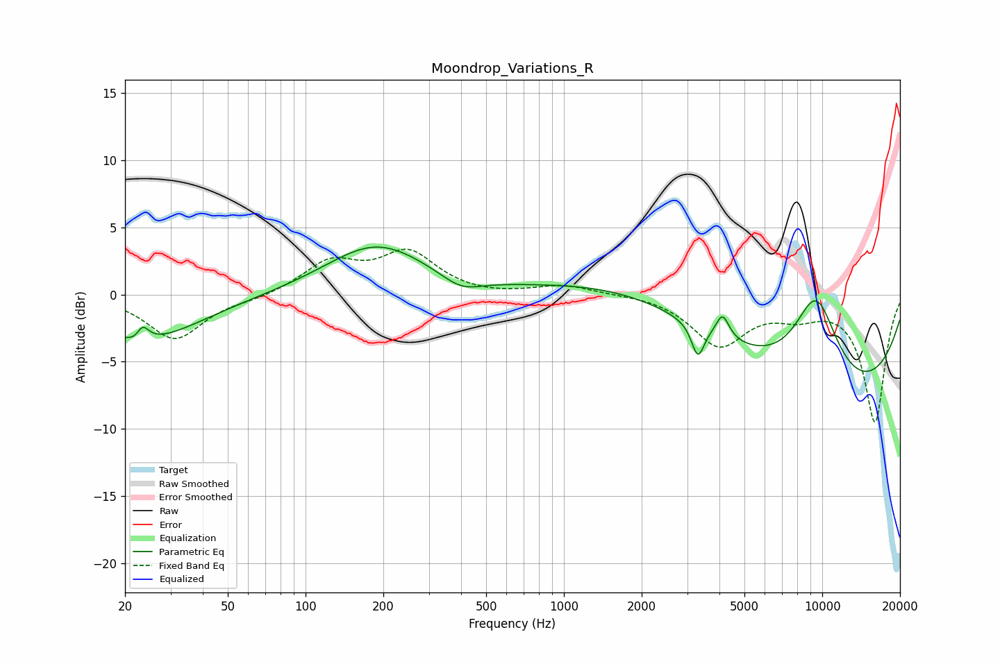

# Moondrop_Variations_R
See [usage instructions](https://github.com/jaakkopasanen/AutoEq#usage) for more options and info.

### Parametric EQs
Apply preamp of -3.6 dB when using parametric equalizer.

|   # | Type    |   Fc (Hz) |    Q |   Gain (dB) |
|-----|---------|-----------|------|-------------|
|   1 | Peaking |        23 | 5.24 |        -2.2 |
|   2 | Peaking |        23 | 0.63 |        -3.5 |
|   3 | Peaking |        23 | 5.52 |         3   |
|   4 | Peaking |       188 | 0.73 |         3.7 |
|   5 | Peaking |       400 | 1.82 |        -1   |
|   6 | Peaking |      3301 | 5.89 |        -2.4 |
|   7 | Peaking |      4111 | 5.58 |         1.8 |
|   8 | Peaking |      4923 | 0.2  |         3   |
|   9 | Peaking |      9460 | 1.41 |         6.8 |
|  10 | Peaking |      9954 | 0.27 |       -10   |

### Fixed Band EQs
When using fixed band (also called graphic) equalizer, apply preamp of **-3.5 dB** (if available) and set gains manually with these parameters.

|   # | Type    |   Fc (Hz) |    Q |   Gain (dB) |
|-----|---------|-----------|------|-------------|
|   1 | Peaking |        31 | 1.41 |        -3.3 |
|   2 | Peaking |        62 | 1.41 |        -0.3 |
|   3 | Peaking |       125 | 1.41 |         2.3 |
|   4 | Peaking |       250 | 1.41 |         3   |
|   5 | Peaking |       500 | 1.41 |        -0.1 |
|   6 | Peaking |      1000 | 1.41 |         0.7 |
|   7 | Peaking |      2000 | 1.41 |         0.1 |
|   8 | Peaking |      4000 | 1.41 |        -3.7 |
|   9 | Peaking |      8000 | 1.41 |        -1.2 |
|  10 | Peaking |     16000 | 1.41 |        -9.4 |

### Graphs

