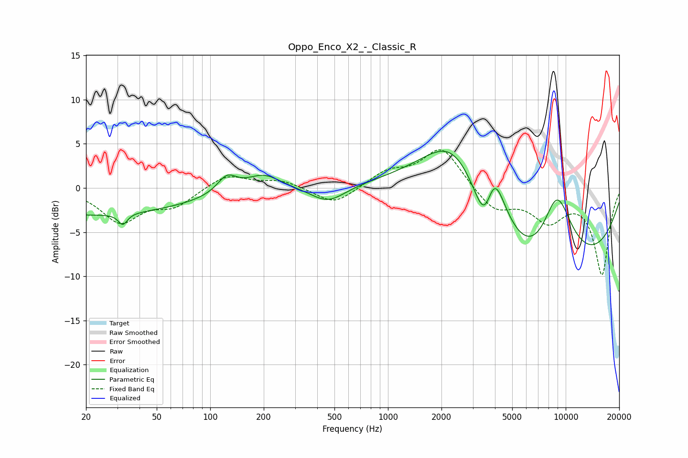

# Oppo_Enco_X2_-_Classic_R
See [usage instructions](https://github.com/jaakkopasanen/AutoEq#usage) for more options and info.

### Parametric EQs
Apply preamp of -4.3 dB when using parametric equalizer.

|   # | Type    |   Fc (Hz) |    Q |   Gain (dB) |
|-----|---------|-----------|------|-------------|
|   1 | Peaking |        20 | 0.22 |        -3   |
|   2 | Peaking |        32 | 5.75 |        -1.3 |
|   3 | Peaking |       124 | 2.6  |         1.9 |
|   4 | Peaking |       199 | 1.43 |         1.8 |
|   5 | Peaking |       460 | 1.45 |        -1.9 |
|   6 | Peaking |      2348 | 0.63 |        11.1 |
|   7 | Peaking |      3544 | 2.27 |        -7.6 |
|   8 | Peaking |      3911 | 2.15 |         8.6 |
|   9 | Peaking |      7618 | 0.34 |       -17.8 |
|  10 | Peaking |      8893 | 1.04 |        14.1 |

### Fixed Band EQs
When using fixed band (also called graphic) equalizer, apply preamp of **-4.4 dB** (if available) and set gains manually with these parameters.

|   # | Type    |   Fc (Hz) |    Q |   Gain (dB) |
|-----|---------|-----------|------|-------------|
|   1 | Peaking |        31 | 1.41 |        -3.7 |
|   2 | Peaking |        62 | 1.41 |        -1.9 |
|   3 | Peaking |       125 | 1.41 |         1.6 |
|   4 | Peaking |       250 | 1.41 |         0.8 |
|   5 | Peaking |       500 | 1.41 |        -2   |
|   6 | Peaking |      1000 | 1.41 |         1.7 |
|   7 | Peaking |      2000 | 1.41 |         4.6 |
|   8 | Peaking |      4000 | 1.41 |        -2.6 |
|   9 | Peaking |      8000 | 1.41 |        -3.4 |
|  10 | Peaking |     16000 | 1.41 |        -9.7 |

### Graphs

