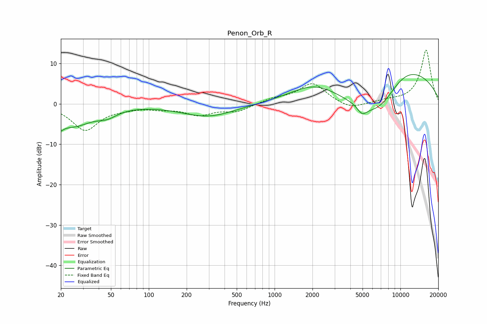

# Penon_Orb_R
See [usage instructions](https://github.com/jaakkopasanen/AutoEq#usage) for more options and info.

### Parametric EQs
Apply preamp of -7.4 dB when using parametric equalizer.

|   # | Type    |   Fc (Hz) |    Q |   Gain (dB) |
|-----|---------|-----------|------|-------------|
|   1 | Peaking |        20 | 1.63 |         0.1 |
|   2 | Peaking |        20 | 5.45 |        -5.2 |
|   3 | Peaking |        20 | 6    |         3.1 |
|   4 | Peaking |        25 | 0.92 |        -5.2 |
|   5 | Peaking |        47 | 1.8  |        -1.7 |
|   6 | Peaking |       295 | 0.67 |        -3.1 |
|   7 | Peaking |      2078 | 0.71 |         4.7 |
|   8 | Peaking |      4961 | 3.71 |        -2.1 |
|   9 | Peaking |      6702 | 0.57 |       -12.8 |
|  10 | Peaking |     10000 | 0.39 |        14.3 |

### Fixed Band EQs
When using fixed band (also called graphic) equalizer, apply preamp of **-13.4 dB** (if available) and set gains manually with these parameters.

|   # | Type    |   Fc (Hz) |    Q |   Gain (dB) |
|-----|---------|-----------|------|-------------|
|   1 | Peaking |        31 | 1.41 |        -6.4 |
|   2 | Peaking |        62 | 1.41 |        -0.7 |
|   3 | Peaking |       125 | 1.41 |        -0.9 |
|   4 | Peaking |       250 | 1.41 |        -2.5 |
|   5 | Peaking |       500 | 1.41 |        -1.8 |
|   6 | Peaking |      1000 | 1.41 |         1.2 |
|   7 | Peaking |      2000 | 1.41 |         5.1 |
|   8 | Peaking |      4000 | 1.41 |        -1.6 |
|   9 | Peaking |      8000 | 1.41 |         0.6 |
|  10 | Peaking |     16000 | 1.41 |        13.4 |

### Graphs

