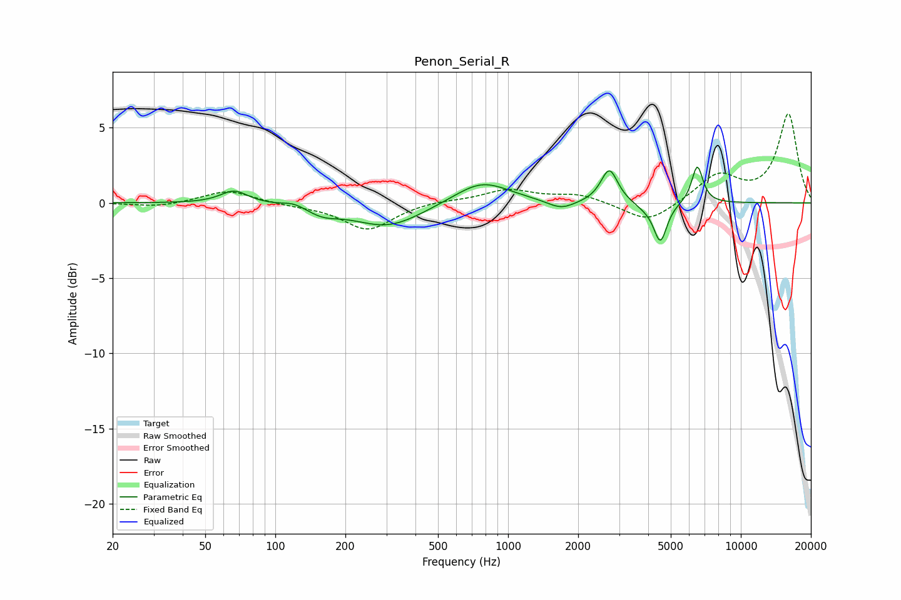

# Penon_Serial_R
See [usage instructions](https://github.com/jaakkopasanen/AutoEq#usage) for more options and info.

### Parametric EQs
Apply preamp of -2.5 dB when using parametric equalizer.

|   # | Type    |   Fc (Hz) |    Q |   Gain (dB) |
|-----|---------|-----------|------|-------------|
|   1 | Peaking |        67 | 2.43 |         0.9 |
|   2 | Peaking |       120 | 2.92 |         0.3 |
|   3 | Peaking |       160 | 2.06 |        -0.5 |
|   4 | Peaking |       304 | 0.94 |        -1.6 |
|   5 | Peaking |       771 | 1.18 |         1.5 |
|   6 | Peaking |      1689 | 2.41 |        -0.6 |
|   7 | Peaking |      2723 | 3.94 |         2.3 |
|   8 | Peaking |      3867 | 3.07 |        -0.3 |
|   9 | Peaking |      4511 | 4.96 |        -2.6 |
|  10 | Peaking |      6501 | 5.69 |         2.5 |

### Fixed Band EQs
When using fixed band (also called graphic) equalizer, apply preamp of **-6.0 dB** (if available) and set gains manually with these parameters.

|   # | Type    |   Fc (Hz) |    Q |   Gain (dB) |
|-----|---------|-----------|------|-------------|
|   1 | Peaking |        31 | 1.41 |        -0.3 |
|   2 | Peaking |        62 | 1.41 |         0.9 |
|   3 | Peaking |       125 | 1.41 |        -0.1 |
|   4 | Peaking |       250 | 1.41 |        -1.8 |
|   5 | Peaking |       500 | 1.41 |         0.2 |
|   6 | Peaking |      1000 | 1.41 |         0.8 |
|   7 | Peaking |      2000 | 1.41 |         0.6 |
|   8 | Peaking |      4000 | 1.41 |        -1.4 |
|   9 | Peaking |      8000 | 1.41 |         1.8 |
|  10 | Peaking |     16000 | 1.41 |         5.9 |

### Graphs

