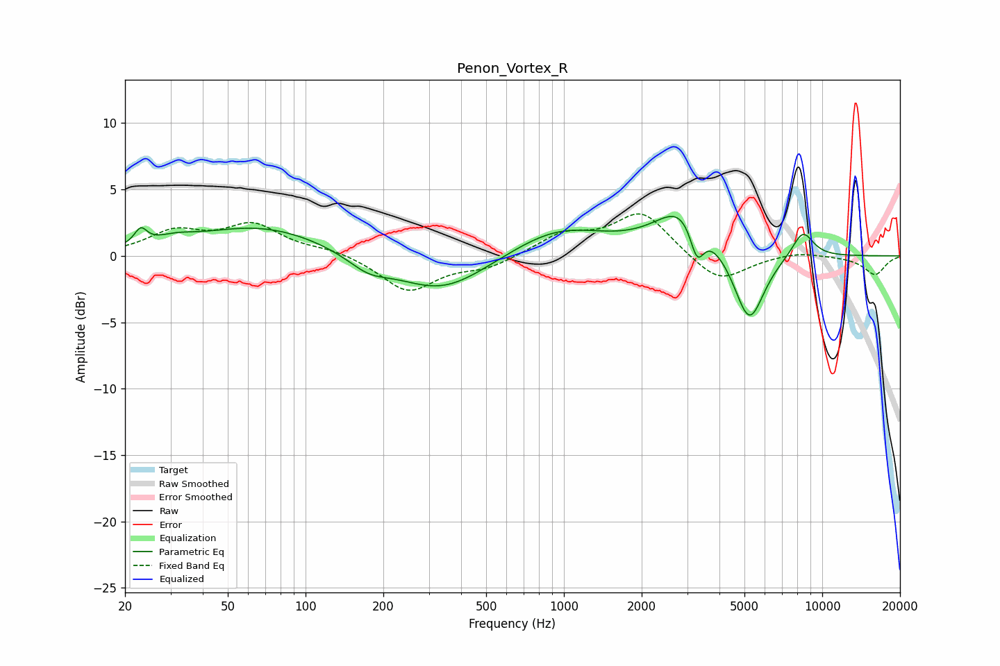

# Penon_Vortex_R
See [usage instructions](https://github.com/jaakkopasanen/AutoEq#usage) for more options and info.

### Parametric EQs
Apply preamp of -3.1 dB when using parametric equalizer.

|   # | Type    |   Fc (Hz) |    Q |   Gain (dB) |
|-----|---------|-----------|------|-------------|
|   1 | Peaking |        23 | 5.91 |         1.2 |
|   2 | Peaking |        31 | 1.9  |         0.5 |
|   3 | Peaking |        67 | 0.55 |         2.2 |
|   4 | Peaking |       175 | 1.76 |        -1.1 |
|   5 | Peaking |       335 | 0.79 |        -2.9 |
|   6 | Peaking |       954 | 0.75 |         2.1 |
|   7 | Peaking |      2908 | 1.32 |         3.6 |
|   8 | Peaking |      3276 | 5.12 |        -2.7 |
|   9 | Peaking |      5214 | 2.34 |        -5.5 |
|  10 | Peaking |      8410 | 3.07 |         2   |

### Fixed Band EQs
When using fixed band (also called graphic) equalizer, apply preamp of **-3.3 dB** (if available) and set gains manually with these parameters.

|   # | Type    |   Fc (Hz) |    Q |   Gain (dB) |
|-----|---------|-----------|------|-------------|
|   1 | Peaking |        31 | 1.41 |         1.7 |
|   2 | Peaking |        62 | 1.41 |         2.2 |
|   3 | Peaking |       125 | 1.41 |         0.4 |
|   4 | Peaking |       250 | 1.41 |        -2.7 |
|   5 | Peaking |       500 | 1.41 |        -0.8 |
|   6 | Peaking |      1000 | 1.41 |         1.5 |
|   7 | Peaking |      2000 | 1.41 |         3.3 |
|   8 | Peaking |      4000 | 1.41 |        -2.1 |
|   9 | Peaking |      8000 | 1.41 |         0.4 |
|  10 | Peaking |     16000 | 1.41 |        -1.4 |

### Graphs

