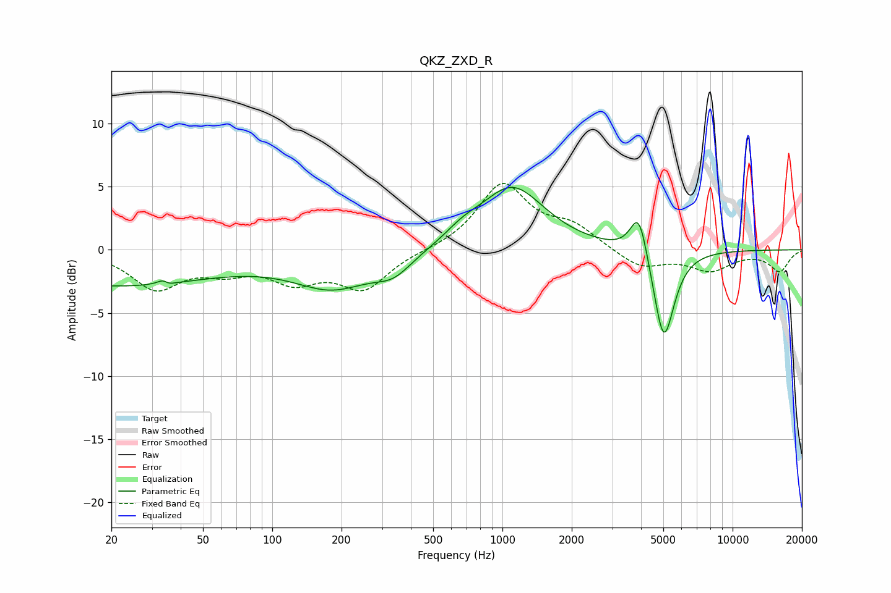

# QKZ_ZXD_R
See [usage instructions](https://github.com/jaakkopasanen/AutoEq#usage) for more options and info.

### Parametric EQs
Apply preamp of -5.0 dB when using parametric equalizer.

|   # | Type    |   Fc (Hz) |    Q |   Gain (dB) |
|-----|---------|-----------|------|-------------|
|   1 | Peaking |        21 | 0.32 |        -2.8 |
|   2 | Peaking |        34 | 5.58 |         2.5 |
|   3 | Peaking |        35 | 5.6  |        -2.4 |
|   4 | Peaking |       175 | 1.79 |        -0.1 |
|   5 | Peaking |       186 | 0.76 |        -2.7 |
|   6 | Peaking |       337 | 1.79 |        -1.3 |
|   7 | Peaking |       670 | 1.86 |         0.8 |
|   8 | Peaking |      1102 | 1.01 |         5   |
|   9 | Peaking |      3919 | 3.73 |         3.7 |
|  10 | Peaking |      5022 | 3.05 |        -7.5 |

### Fixed Band EQs
When using fixed band (also called graphic) equalizer, apply preamp of **-5.3 dB** (if available) and set gains manually with these parameters.

|   # | Type    |   Fc (Hz) |    Q |   Gain (dB) |
|-----|---------|-----------|------|-------------|
|   1 | Peaking |        31 | 1.41 |        -2.9 |
|   2 | Peaking |        62 | 1.41 |        -1.3 |
|   3 | Peaking |       125 | 1.41 |        -2.2 |
|   4 | Peaking |       250 | 1.41 |        -2.9 |
|   5 | Peaking |       500 | 1.41 |        -0   |
|   6 | Peaking |      1000 | 1.41 |         5.1 |
|   7 | Peaking |      2000 | 1.41 |         1.7 |
|   8 | Peaking |      4000 | 1.41 |        -1.5 |
|   9 | Peaking |      8000 | 1.41 |        -1.5 |
|  10 | Peaking |     16000 | 1.41 |        -1.7 |

### Graphs

